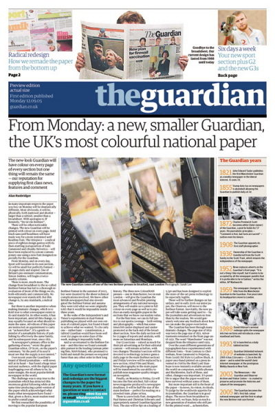
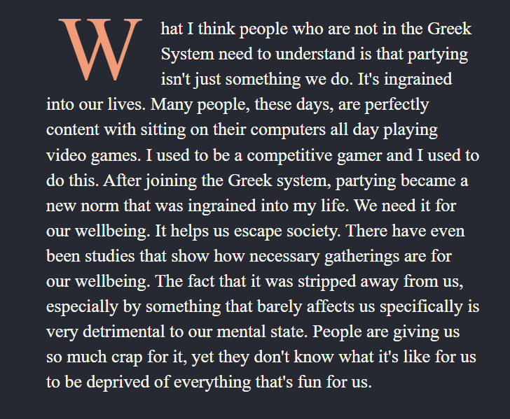

We have been stuck in vertical flow of a page for long. Let's change it...

* Table of content
{:toc}

## Flow

> Refer -> [CSS Flow Layout - MDN](https://developer.mozilla.org/en-US/docs/Web/CSS/CSS_flow_layout)

**Flow layout** [aka normal flow] is the way block and inline elements are displayed on a page before stylesheet rules change their layout.

* Inline elements are laid out horizontally. This is called **horizontal flow**.
* Meanwhile, block elements are laid out vertically. This is called **vertical flow**.

### Float

``float`` is introduced to implement layouts that involve an image standing side-by-side to a column of text. Something that you might find in a newspaper.



Let's try implementing a drop-cap for a copypasta.

```html
<p class="paragraph">
<span class="red">W</span>
hat I think people who are not in the Greek
System need to understand
...
that's fun for us. 
</p>
```

```css
.paragraph
{
color: #F9FBF2;
margin: 0 1rem 0 3rem;
padding: 1rem 0 0 10px;
line-height: 1.4rem;
font-size: 1rem;
}
.red
{
float: left;
margin: 0.5rem 1rem 10px 10px;
padding: 10px 0 10px 0;
color: #F19C79;
font-size: 5rem;
font-family: serif;
}
```

And here is our result :



> If anyone needs this text, [here you go](https://www.reddit.com/r/copypasta/comments/hpm2hq/a_frat_guy_at_my_university_had_a_meltdown_that/)!

#### Clearing the float

When we float an element, it's removed from the normal flow of the page. Other elements will adjust alongside it.

If we wish to stop the other elements from moving up and awkwardly jamming the upper elements, we use the ``clear`` property.

Or, if the floating element is out of a box behind it [like a background or something], we could use ``display: flow-root`` to extend the box.
