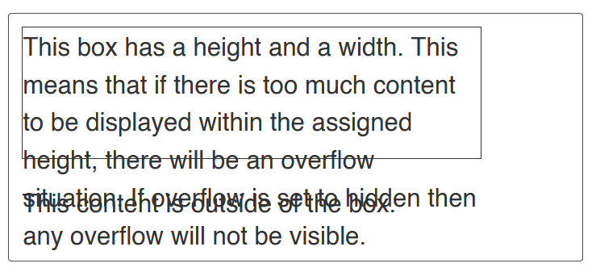
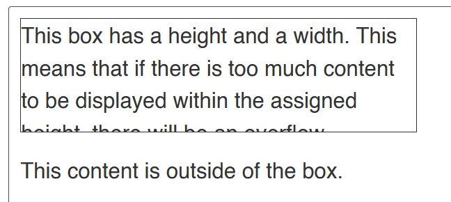
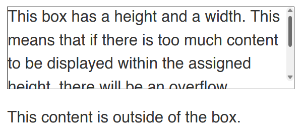

Overflow happens when we load in way too much content in our page. Here's how you reduce it...

* Table of content
{:toc}

## Overflow

> Refer -> [CSS - Overflowing Content | MDN web docs](https://developer.mozilla.org/en-US/docs/Learn/CSS/Building_blocks/Overflowing_content)

Like we said before in [our previous note](2024-08-03-css-box-model.md), everything in CSS is a box. If there's too much content jammed into a box, it overflows.

CSS does this to not hide any content. This prevents data loss, but gives us a nasty looking webpage if left unchecked.

### `overflow` property

This property helps us to tackle this problem. Its default value is ``visible`` so that we can notice when the content's overflowing.

To crop content when it overflows, we use ``overflow: hidden``. At times, it may hide some content.

To prevent this, we'd use ``overflow: scroll`` to provide the user with scroll-bars.

* ``overflow-y`` creates scroll bars on the right side of the webpage [the usual one]
* ``overflow-x`` creates scroll bars at the bottom of the page

Sometimes, we'd need to wrap text in our box, especially when it is a lengthy one. We'd use ``overflow: wrap`` for this purpose.

To let the browser handle by itself, use ``overflow: auto``. It'll decide whether to use scroll-bars or not according to your content.
