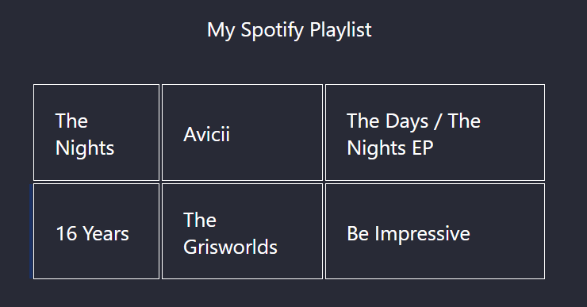
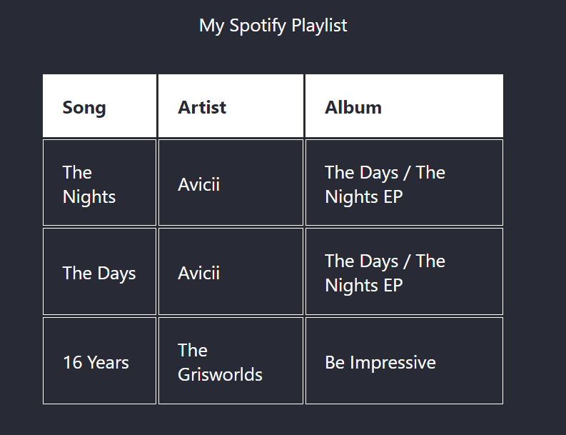
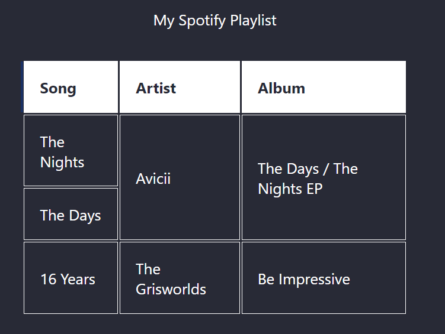
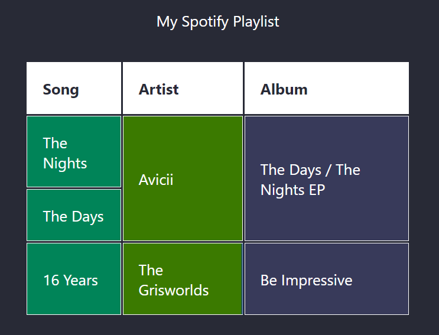

You want to learn how to organise data in a table? You've come to the right place!

* Table of content
{:toc}

## Tables in HTML

Tables are easily created in HTML using this format :

```html
<table>
    <caption>Title goes here</caption>
    <thead>
        <tr>
            <th scope="col">Col1</th>
            <th scope="col">Col2</th>
        </tr>
    </thead>
    <tbody>
        <tr>
          <th scope="row">Row, row, row a boat</th>
          <td>Gently down the stream...</td>
        </tr>
    </tbody>
    <tfoot>
        <tr>
          <th scope="row" colspan="2">Main stats</th>
          <td colspan="2">Some number goes here</td>
        </tr>
    </tfoot>
</table>
```

Okay, okay, now that's a *lot* of things to take in. Let's simplify it [along with a step-by-step guide to do it practically, I promise!].

### How to create a table

We create a table using the tag ``<table>``.

```html
<table>
    <caption>My Spotify Playlist</caption>
</table>
```

This table can have a ``<caption>`` tag that works as a title for the table.

#### Rows

Rows are made using the ``<tr>`` tag [literally means table row]. These contains little ``<td>`` [table cell / data] tags in them.

```html
<table>
      <caption>My Spotify Playlist</caption>
      <tr>
        <td>The Nights</td>
        <td>Avicii</td>
        <td>The Days / The Nights EP</td>
      </tr>
      <tr>
        <td>16 Years</td>
        <td>The Grisworlds</td>
        <td>Be Impressive</td>
      </tr>
  </table>
```

Now our table will look like this :



Our table looks neat, but not very descriptive. How do we fix that?

#### Headers

The answer is to introduce headers!

Headers are special cells that belong at the start of a row or column. They indicate what's being listed in the row or the column.

Now let's modify our table to show proper headers :

```html
<table>
    <caption>My Spotify Playlist</caption>
    <thead>
        <td>Song</td>
        <td>Artist</td>
        <td>Album</td>
    </thead>
    <tr>
        <td>The Nights</td>
        <td>Avicii</td>
        <td>The Days / The Nights EP</td>
    </tr>
    <tr>
        <td>The Days</td>
        <td>Avicii</td>
        <td>The Days / The Nights EP</td>
    </tr>
    <tr>
        <td>16 Years</td>
        <td>The Grisworlds</td>
        <td>Be Impressive</td>
    </tr>
</table>
```



Our table now looks ready! I've added another row in here to make it extra ready.

Next is the ``<tbody>`` tag. This is where we include the main content of the table.

You notice a thing - row 1 and row 2 share a common artist and album. So why not combine the cells [like we do in Excel] and make it have one common artist?

```html
<table>
    <caption>My Spotify Playlist</caption>
    <thead>
        <td>Song</td>
        <td>Artist</td>
        <td>Album</td>
    </thead>
    <tr>
        <td>The Nights</td>
        <td rowspan="2">Avicii</td>
        <td rowspan="2">The Days / The Nights EP</td>
    </tr>
    <tr>
        <td>The Days</td>
    </tr>
    <tr>
        <td>16 Years</td>
        <td>The Grisworlds</td>
        <td>Be Impressive</td>
    </tr>
</table>
```



Notice how I made the artist and the album 'flow' over to the next row and deleted the previously-existing cells in the 'The Days' row.

Using ``rowspan``, you can make a cell 'flow' over to the next row; same goes for ``colspan``. Just be sure to delete the extra bit left in the old row!

Finally, we'd use the ``<tfoot>`` tag to create our footer. This is where we add content such as statistics, summaries about the table, etc.

```html
<table>
    <colgroup>
    <col style="background-color: rgb(0, 132, 88);"/>
    <col style="background-color: rgb(59, 122, 0);"/>
    <col style="background-color: rgb(56, 58, 90);"/>
    </colgroup>
      <caption>My Spotify Playlist</caption>
      <thead>
          <td>Song</td>
          <td>Artist</td>
          <td>Album</td>
      </thead>
      <tbody>
        <tr>
          <td>The Nights</td>
          <td rowspan="2">Avicii</td>
          <td rowspan="2">The Days / The Nights EP</td>
        </tr>
        <tr>
          <td>The Days</td>
        </tr>
        <tr>
          <td>16 Years</td>
          <td>The Grisworlds</td>
          <td>Be Impressive</td>
        </tr>
        <tr>
          <td>My Type</td>
          <td>Saint Motel</td>
          <td>My Type EP</td>
        </tr>
        <tr>
          <td>Life Goes On</td>
          <td>BTS</td>
          <td>BE</td>
        </tr>
      </tbody>
      <tfoot>
        <td colspan="2">Songs in Total</td>
        <td>5</td>
      </tfoot>
  </table>
```


### Styling our table

Now let's style our table with some CSS.

```html
<table>
    <caption>My Spotify Playlist</caption>
    <thead>
        <td>Song</td>
        <td>Artist</td>
        <td>Album</td>
    </thead>
    <tr>
        <td style="font-family: monospace">The Nights</td>
        <td style="font-family: monospace" rowspan="2">Avicii</td>
        <td  style="font-family: monospace" rowspan="2">The Days / The Nights EP</td>
    </tr>
    <tr>
        <td style="font-family: monospace">The Days</td>
    </tr>
    <tr>
        <td style="font-family: monospace">16 Years</td>
        <td style="font-family: monospace">The Grisworlds</td>
        <td style="font-family: monospace">Be Impressive</td>
    </tr>
</table>
```

It's annoying to specify styles on every single ``<td>`` or ``<th>``. We'd probably use a class selector or something else. This 'something else' is called `<col>`.

#### `<col>` me Ishmael

Instead of wasting our time with applying CSS styles to each ``<td>``, we'd use this.

```html
<table>
    <colgroup>
        <col style="background-color: rgb(0, 132, 88);"/>
        <col style="background-color: rgb(59, 122, 0);"/>
        <col style="background-color: rgb(56, 58, 90);"/>
    </colgroup>
    <caption>My Spotify Playlist</caption>
    <thead>
        <td>Song</td>
        <td>Artist</td>
        <td>Album</td>
    </thead>
    <tr>
        <td>The Nights</td>
        <td rowspan="2">Avicii</td>
        <td rowspan="2">The Days / The Nights EP</td>
    </tr>
    <tr>
        <td>The Days</td>
    </tr>
    <tr>
        <td>16 Years</td>
        <td>The Grisworlds</td>
        <td>Be Impressive</td>
    </tr>
</table>
```



``<col>`` elements are contained within the ``<colgroup>``. Each ``<col>`` affects a column, so we've three of them for our three columns.

#### Helping the visually-impaired

Here's a statistic from the WHO :

> Globally, at least 2.2 billion people have a near or distance vision impairment. In at least 1 billion – or almost half – of these cases, vision impairment could have been prevented or has yet to be addressed.

While we have saying such as 'eyes are the windows to the world' and 'eyes reveal a person's soul', a good deal of people can't perceive the world like we do.

Here's a way to help them out :
> [For people living in India](https://theiab.org/pages/donate-now)
> [For people in abroad](https://donate.fightforsight.org.uk/?content=general&returnurl=https%3A%2F%2Fwww.fightforsight.org.uk%2Fdonate%2Fthank-you%2F)

Now let's see some ways to help them as web-developers. One such way is the ``scope`` attribute. It helps the screen-reader to identify the elements inside the table.
