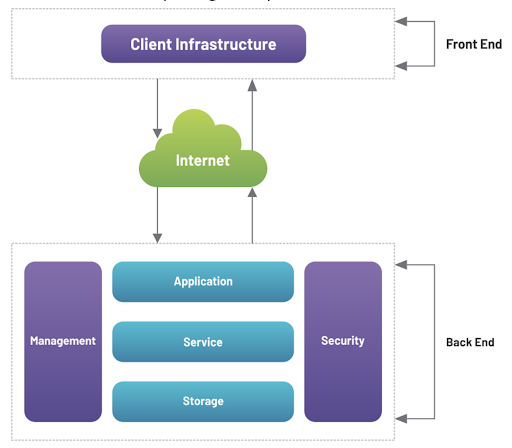
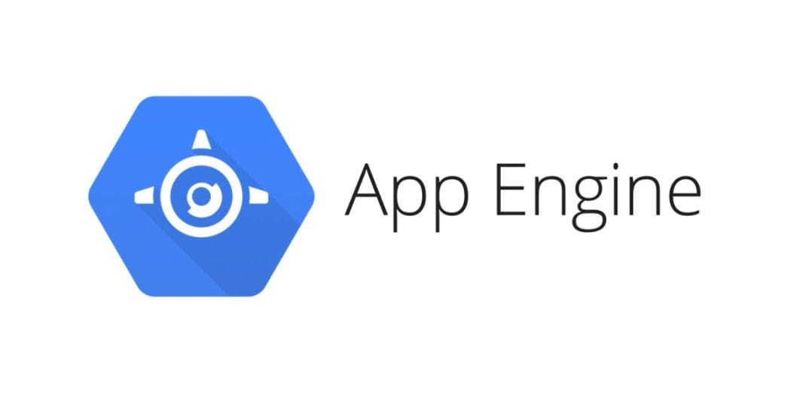
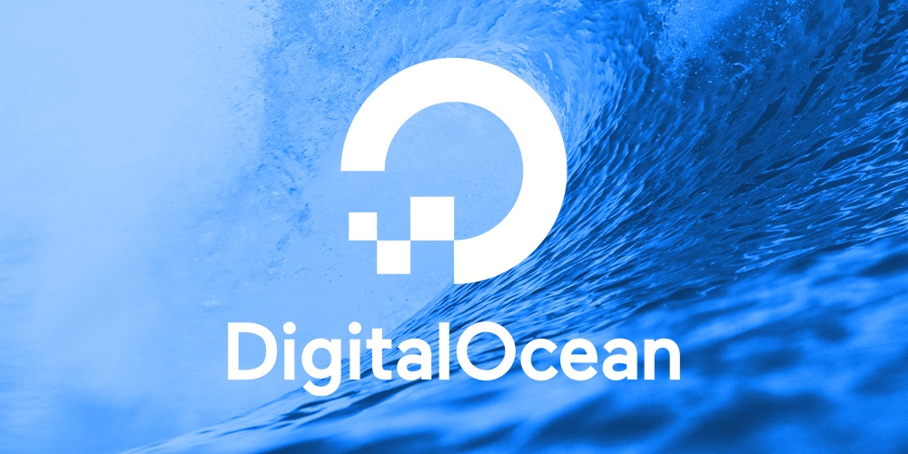

Here's my revision notes for Cloud Computing...

* Table of content
{:toc}

## Cloud computing

> Refer -> [Cloud Computing - TechTerms](https://techterms.com/definition/cloud_computing)

It refers to applications and services [mainly services] that are offered over the Internet from various data centers across the world.

**Okay, what's cloud?**

Cloud is a [network](..\2024-08-06-internet.md) of servers across the world. These store data in form of database [tables] and software to do stuff with them.

Companies often find it difficult to store huge amounts of data in their databases and in-house servers.

> Netflix, for example, stores 12 TB of data per hour per user. That's petabytes worth of storage for a few thousand users alone!

These companies migrate [transfer their data to a cloud server] to cloud so that they don't have to do the gruelling work of maintaining physical servers, running applications, etc.

## Types of cloud services

There are 3 types of cloud services :

### Public cloud

* Managed by 3rd party providers.
* Available on subscription-basis.
* Multi-tenant; serves multiple users
* Best for small businesses - minimises infrastructure costs, handles data loads, etc.

Eg : Azure, AWS, etc.

#### Advantages

* Cost efficient
* Optimized to give maximum performance
* Flexible per demand and workload

#### Disadvantages

* Frequent data breaches
* Trusting 3rd-party provider with our data is a risky business

### Private cloud

* Work on private infrastructure
* Not subscription-based; billing depends on enterprise and departments

Eg : Dell Cloud Solutions, VMware vCloud suite, etc.

#### Advantages

* Customer information is protected
* Specific operations are available instead of generalised ones.

#### Disadvantages

* Requires knowledge and skill to manage
* Only accessible within a particular area

### Hybrid cloud

* Combines features of private and public clouds.
* Heterogeneous [different in some category] clouds.
* Flexible per demand and workload
* Secure

Eg : Oracle Cloud, Azure Stack, etc.

#### Advantages

* Cheaper than other clouds
* Safe and secure as it works on distributed system network

#### Disadvantages

* Requires knowledge to work in it
* Difficult to maintain it

## Cloud Computing architecture

Cloud architecture is divided into front-end and back-end.

**Front-end** is where clients can access services. It contains the UI and applications used by them.

**Back-end** is where the resources, virtual applications, deployment models, etc. are stored. This part is used by the service provider to work on the front-end.

### Components

> Note : Except the client infrastructure and the Internet, every other components works in the back-end.

**Client infrastructure** : Contains applications and UI to access the cloud platform.

**Application** : Software platform that provides a service as per the client's requirement.

**Service** : Cloud-based services which the user can access

**Runtime Cloud** : Provides execution and runtime environment to the virtual machine

**Storage** : Provides flexible storage services

**Infrastructure** : Hardware and software components of cloud

**Management** : Management of back-end components

**Security** : Implementing different security measures in the back-end to protect client's data

**Internet** : Connects front-end and back-end; establishes communication between them

**Analytics** : Provides analytics capabilities to generate statistics from data in cloud for machine learning

**Database** : Providing database for storing structured data such as SQL

## Delivery models

There are a variety of cloud delivery models :

### Software As A Service

* Delivering services and applications via the internet
* Subscription model for accessing software directly in the web; no need to download.
* Aka hosted software, on-demand software.

Eg : MS Office 365, Crowdstrike, etc.

#### Advantages

* Pay only for what you use
* Can be accessed from anywhere
* Automatic updates
* No need to download the software to access features

#### Disadvantages

* Data breaches
* Updates may break features [see Crowdstrike]
* Dependent on internet connectivity
* Limited control over data

### Platform As A Service

* Provider hosts hardware and software on its own infrastructure
* Used for building applications and services over the internet
* Development and deployment is hardware-independent
* Customer doesn't control the backend infrastructure

Eg : Google App Engine, Windows Azure, etc.

#### Advantages

* Simple and convenient
* Cost-effective
* Reduced complexity

#### Disadvantages

* Dependent on provider
* Limited flexibility

### Infrastructure As A Service

* Infrastructure is provided as outsourcing to enterprises
* Aka Hardware as a service
* Provides OS, networking, security and servers
* Customers pay per-user by the hour, week, etc.

Eg : DigitalOcean, AWS, etc.

#### Advantages

* Cost-effective
* Secure
* Easy to maintain

#### Disadvantages

* Users are responsible for securing their own data
* May not be accessible in certain areas
