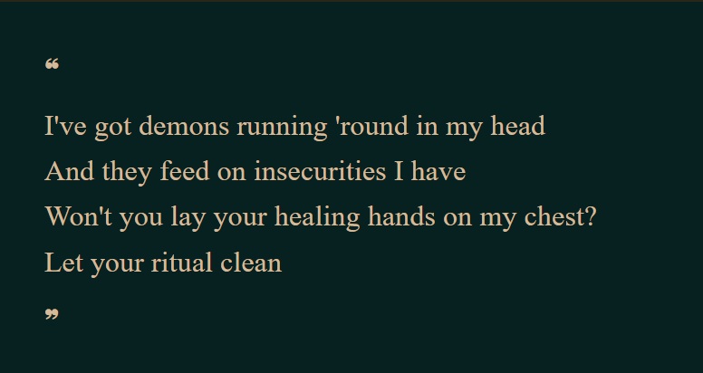
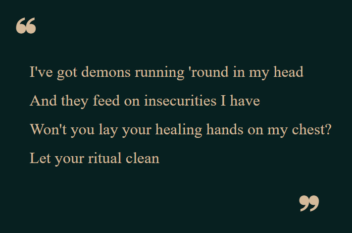

Let's look up ways to position elements in our page...

* Table of content
{:toc}

## Position

Positioning is one of the crown jewels of CSS. It decides where the elements will be placed in the page. To alter our elements' positions, we'll be using the ``position`` property.

The default position for every element is ``position: static``.

### Relative position

``position: relative`` lets us modify the position for an element. Let's try it out in our small problem :

Suppose we have made a page for displaying the lyrics of a song :



[Props to you if you recognise the lyrics!]

We wish to get the quote marks right. Also, we'll need to fix the alignment of our quoted lyrics.

```html
<div class="holder">
<div class="content">
    <span class="quote left">❝</span>
    <p class="text">I've got demons running 'round in my head</p>
    <p class="text">And they feed on insecurities I have</p>
    <p class="text">Won't you lay your healing hands on my chest?</p>
    <p class="text">Let your ritual clean</p>
    <span class="quote right">❞</span>
</div>
</div>
```

```css
.text
{
    font-family: 'Times New Roman', Times, serif;
    color: var(--text);
    line-height: 0.7rem;
}
.holder
{
    background-color:rgb(7, 32, 32);
    margin: 1rem;
    padding: 2rem;
}
.quote
{
    color: var(--text);
}
```

We use ``position: relative`` to manually position the quotation marks and the quoted lyrics.

```css
.text
{
        font-family: 'Times New Roman', Times, serif;
        color: var(--text);
        line-height: 1rem;
    }
    .content
    {
        position: relative;
        left: 1.7rem;
    }
    .holder
    {
        background-color:rgb(7, 32, 32);
        margin: 1rem;
        padding: 2rem;
    }
    .quote
    {
        color: var(--text);
        font-size: 3.5rem;
        position: relative;
    }
    .quote.left
    {
        right: 1.2rem;
        top: 1rem;
    }
    .quote.right
    {
        left: 21rem;
        bottom: 0.5rem;
    }
```



### Absolute position

While scrolling through the css stylesheet, you must've noticed the following code:

```css
.quote.right
{
    left: 21rem;
    bottom: 0.5rem;
}
```

This was the snippet used to position the end quote mark. The unit is ridiculous; this is bad code practice and we should find better ways to implement it.

And we do have one : ``position: absolute``.

```css
.text
    {
        font-family: 'Times New Roman', Times, serif;
        color: var(--text);
        line-height: 2rem;
    }
    .holder
    {
        background-color:rgb(7, 32, 32);
        margin: 2rem;
        padding: 5rem;
        line-height: 1rem;
    }
    .quote
    {
        color: var(--text);
        font-size: 3.5rem;
    }
    .quote.left
    {
        position: relative;
        right: 1.2rem;
        top: 1rem;
    }
    .quote.right
    {
        position: absolute;
        right: 25%;
        bottom: 15%
    }
```


In ``position: absolute``, we specify how much distant an element should be from a position. ``position: relative``, on the other hand, behaves similar to `margin` and `padding`.

### Z-Index

Z-index is a reference to z-axis. It refers to what stuff comes up first and what stuff remains last.

```css
z-index: 1;
```
