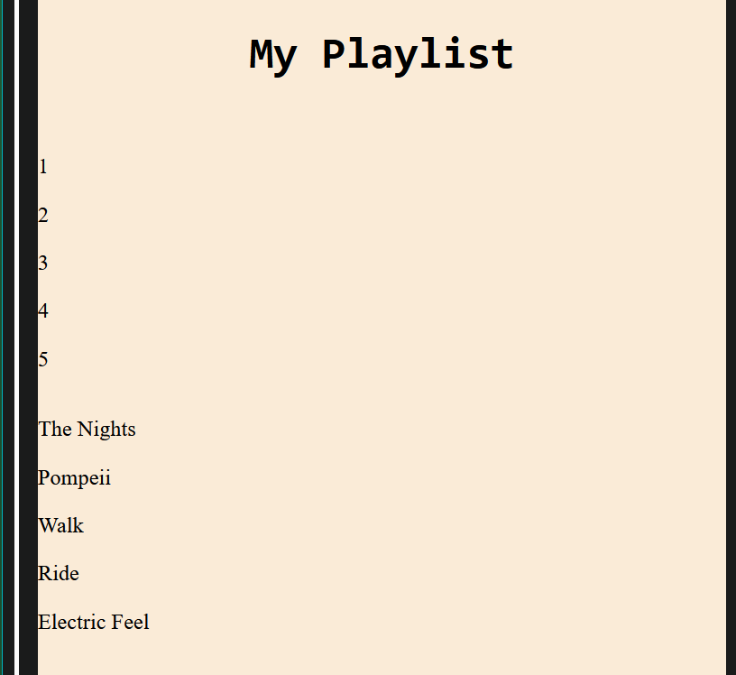
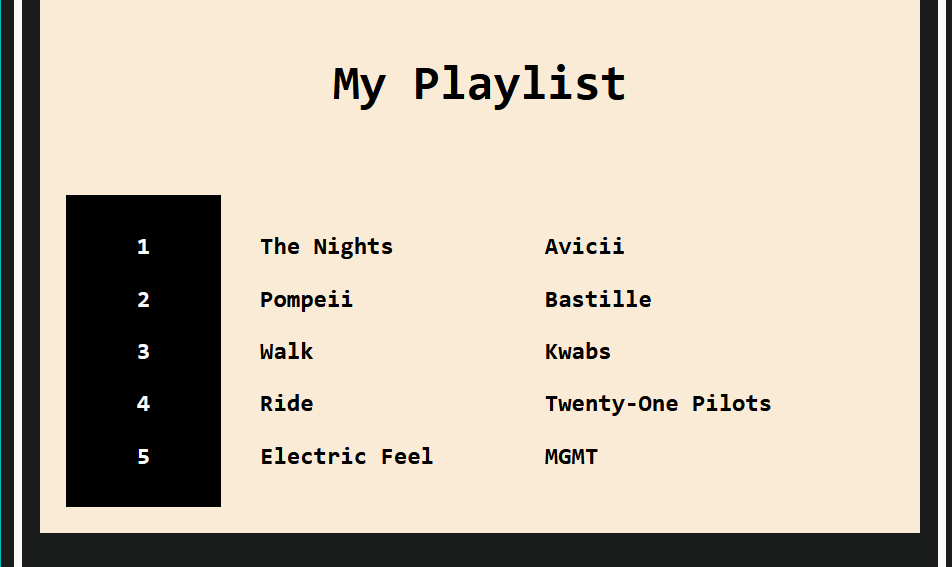

Let's learn about the grid layout...

* Table of content
{:toc}

## Grid layout

You must've seen grids in your daily life - in wickerwork, in woven chairs, tiles, etc.


Now let's get technical - a **grid** is a group of horizontal and vertical lines creating a pattern. This typically has rows, columns and gutters [gaps].


### ``display: grid``

Now let's put this technology to practice. Let's say we wish to create our top 5 songs in Spotify...


This one looks super awkward. Let's fix it using ``display: grid`` in the `<section>` containing these songs :

```css
.list
{
    display: grid;
}
```



Nothing seems to have changed except for some minute spacing between items. That's because we've got a single column spanning across the entire page now. Let's split the items into 3 separate columns.

```css
.list
{
    padding: 1rem;
    display: grid;
    grid-template-columns: 5rem 10rem 10rem;
}
```


Let's look at our code. When dealing with complex grid layouts, it doesn't make sense to use huge units and make our life difficult than it already is.

For that, we shall look into a new unit : `fr`

```css
.list
{
    padding: 1rem;
    display: grid;
    grid-template-columns: 0.3fr 0.5fr 1fr;
}
```

This unit represents a fraction of the available space in the grid container. In short, this unit is *very flexible* and must be used in case of grids.

We shall proceed to spruce the playlist up a bit by adding background and borders.



#### Shorthand

We can set columns [or rows] and their width using this shorthand. Note that the rows or columns will have equal lengths.

```css
grid-template-columns: repeat(3, 1fr);
/*or*/
grid-template-rows: repeat(3, 1fr);
```

### Types of grids

We've seen one type of grid work so far : Explicit grid.

* **Explicit grid** : Created manually
* **Implicit grid** : Extends the created grid when content is placed outside of that grid.

By default, implicit grid has `auto` sized items. If we wish to set their size manually, we use ``grid-auto-rows`` or ``grid-auto-columns``.

#### Protecting from overflow

We'll, of course, need to protect our content from overflowing. To let content enlarge or shrink as per need, we use ``minmax()``.

```css
grid-auto-columns: minmax(1rem, auto);
```
