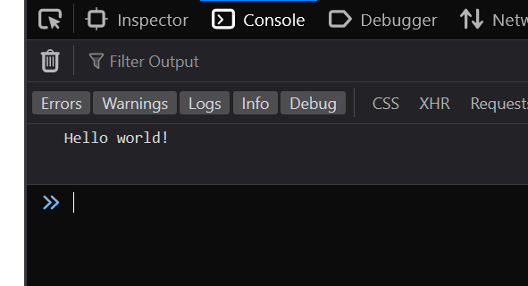

Let's get familiar with one of the most popular programming languages...

* Table of content
{:toc}

## JavaScript


JS is an programming language introduced in 1995 that lets you add scripting [actions] in webpages.

### Aren't Java and JavaScript the same?

People often think Java and JavaScript are the same language, or that JS is a subset of Java. This is **wrong**!

JavaScript, prior to release in September 1995, was called LiveScript. During that period, Java was gaining popularity, and so the creators decided to rename it to JavaScript to cruise this wave and here we are.

### Hello world!

Let's write our first program in JS. We create a HTML file and add in a `<script>` element in there :

```html
<script>
    console.log("Hello world!")
</script>
```

When you open the file in a browser, nothing happens. But, if you use inspect element and go to the console tab...



Hello world! ``console.log()`` works similar to Python's ``print()`` and Java's ``System.out.println();``

### Linking external JS

Just like linking a stylesheet, we can link an external script file to our file.

```html
<script src="fileName.js"></script>
```

### Variables

Unlike other languages, JS lets you declare variables in 3 ways [one way is depreciated, by the way].

```js
let one = 54
const two = 77
var three = 14

console.log(one, two, three)
```

`let` lets you define variables.

`const` lets you define variables that you can't change later on. We normally use it to store some hard-coded and known values [like hex-codes, etc.]

`var` is similar to `let`, but since it's depreciated we won't use it much.

> You can't assign a value to a variable AND perform some operation to it at the same time.

#### Numeric values

Unlike other languages, JS doesn't have any `int`, `float` or `double` types. Numbers are always stored as double-precision floats [aka `double`] and so, it doesn't matter if they have decimals or not.

```js
let x = 10;
let y = 12.4;

console.log(x, y); //both are the same type
```

### Operators

If we use the addition operation on a number and a string, they get concatenated :

```js
let x = 10;
let strung = "Hello";

console.log(x + strung); //10Hello
```

This is because the number gets converted to string to be used for concatenation.

```js
let x = 10;
let y = 10;
let strung = "Hello";

console.log(x + y + strung); //20Hello, not 1010Hello
console.log(strung + x + y); //Hello1010, not 20Hello
```

In the second example, we get this unusual predicament. This happens because the compiler, after encountering a string, assumes the rest of the operands as string as well.

If you ask me why, this is how JS works. Quite a quirky language, this one.

```js
let x = -2;
let y = '10';

console.log(x + y); //-210
```

```js
let x = -2;
let y = '10';

console.log(x - y); //-12
console.log(y - x); //12, because -(-2) = +2
```

Except for addition operator, the rest of the arithmetic operators will convert their operands to numbers before operation.

#### Unary +

JS also has the unary version of + operator.

```js
console.log(+true); //1
console.log(+""); //0
```

The second one's 0 as the string is empty [as in, empty strings are false] and false equals 0.

#### Converting strings to numbers

Very often, we receive string input from HTMl forms. We'll need to convert them to numbers in order to return the correct output.

```js
let ride = "21";
let or = "22";
let die = "23";

console.log(+ride + +die + +or); //66
```

Adding a + symbol before the string variable converts it into a number.

Now let's change values and see what output we get :

```js
let ride = "ladies and gentlemen"; //NaN
let or = "2.3"; //47.3
let die = 23; //66
let ride = "21 Pilots"; //no output
```

In the 1st example, we get `NaN` when we try to convert an actual string to number. This is because we *cannot* convert it into an actual number by normal means.

Same goes for the last example. It returns no output as the compiler's confused at whether to treat it as a string or number.

There's an alternate way to convert :

```js
console.log(Number(ride) + Number(or) + Number(die));
```

> If you try ``console.log(Number(ride+or+die));`` instead, it returns the concatenated version of the variables

```js
let x = 1;
let y = 2;

let z = 77 / (x = y + 2 - 1);
//77 / 3

console.log(z); //25.666666666666668
```

#### Comma operator

Consider the following code :

```js
let a = (1 + 2, 3 + 4);

console.log(a); //7
console.log(1 + 2, 3 + 4); //3, 7
```

#### Comparison operators

The program returns only the 2nd expression. This is because when we use the comma operator, only the result of the last expression is returned [which, in this case, is the 2nd one].

JS has a special comparison operator `===`. It's used to evaluate if two operators have the same value and same type. Its opposite is `!==`.

```js
let a = 10;
let b = "Bye!";
let c = 20;

console.log(a===b); //false
console.log(a===c); //true
console.log(c!==b); //false
```

### Asynchronous JS

JS is a single-threaded programming language.

Hang on, what is a thread?

A **thread** is a sequence of actions being executed one after other. For example, this might be your 'thread' of execution for making a tea :

```md
1. Boil water
2. Add tea
3. Add milk and sugar
4. Heat until done
5. Pour tea in cup
6. Serve tea
```

When we talk about JS being a single-threaded language, we mean that JS only has a single call-stack. Like you, JS can only do one thing at a time.

Meanwhile its namesake, Java, happens to be a multi-threaded language. Meaning, it can handle many things at once, like an all-rounder.

JS being asynchronous [anything that operates independent of other processes] means that it can do other menial tasks while waiting for a task to be completed [again, like you!].
