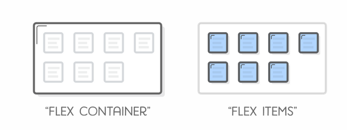
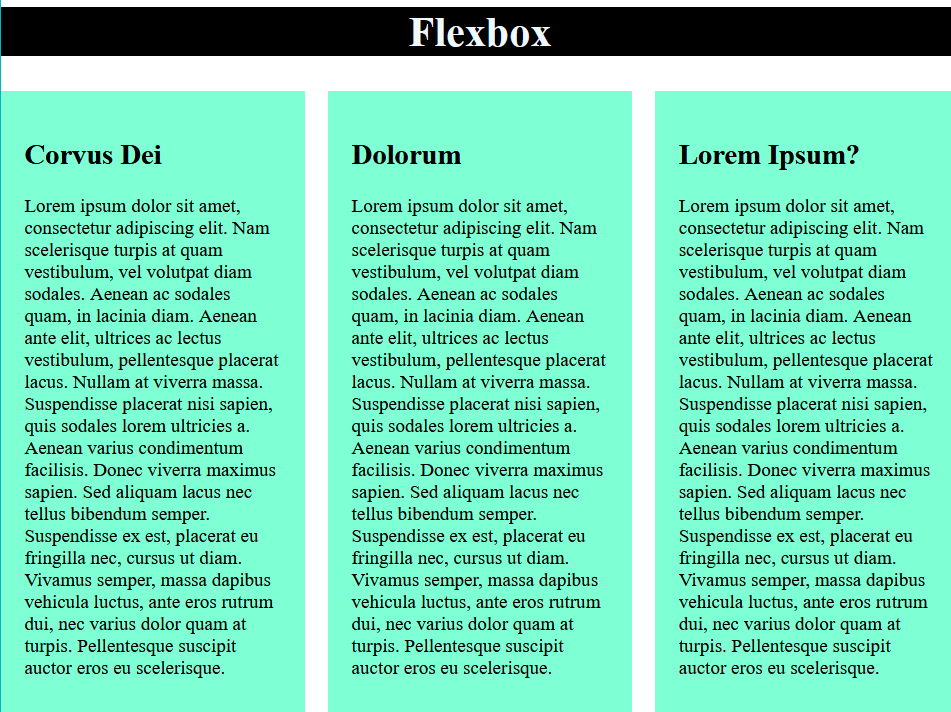
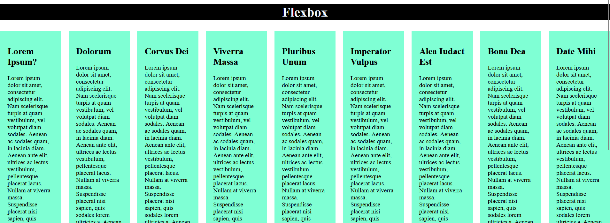
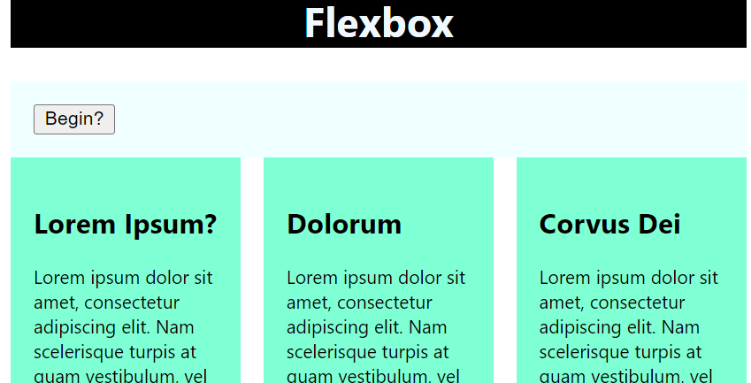
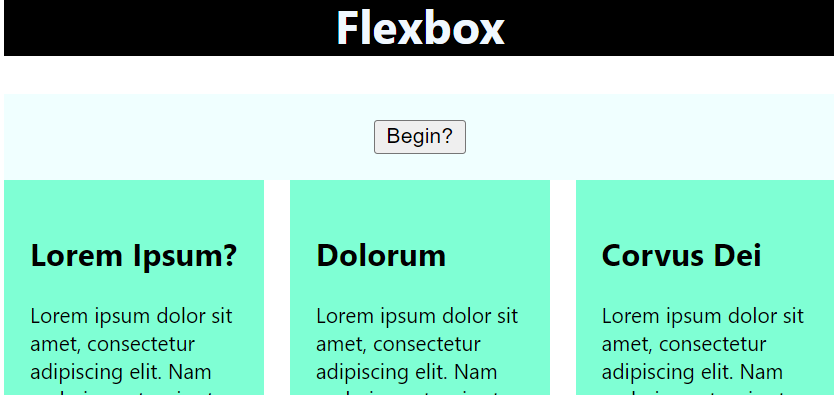

``display: flex`` is a frequently used property in CSS. Here's how we learn to use it...

* Table of content
{:toc}

## `display: flex`

Let's say we've this page with the famous placeholder text...

```html
<section class="header">
    <h1>Flexbox</h1>
</section>

<section class="content">
    <article class="text">
        <h2>Lorem Ipsum?</h2>
        <p>Lorem ipsum dolor...</p>
    </article>
    <article class="text">
        <h2>Dolorum</h2>
        <p>Lorem ipsum dolor...</p>
    </article>
    <article class="text">
        <h2>Corvus Dei</h2>
        <p>Lorem ipsum dolor...</p>
    </article>
</section>
```

```css
.header
{
    text-align: center;
    font-size: 1.2rem;
    background-color: black;
    color: aliceblue;
}
.text
{
    background-color: aquamarine;
    padding: 1rem;
}
```


We wish to arrange these three boxes horizontally rather than vertically. What would we do?

We'd use ``display: flex`` on the parent container.

```css
.content
{
    display: flex;
}
```


Great! We've got the direction changed, but the containers look as if they were merged as one and we want them separated.

```css
.content
{
    display: flex;
    gap: 1rem;
}
```

Adding gap to the parent container [the `<section>`]makes the children [the `<article>`] maintain a gap of 1rem between each box.


If we want the same arrangement as before, we'd use `flex-direction` to change the direction of flex.

```css
.content
{
    display: flex;
    gap: 1rem;
    flex-direction: column;
}
```


> By default, `flex-direction` is set to `row`. This is the direction observed when you first set an element to `display: flex`.

### Learning about flex

> Refer -> [Flexbox - Interneting Is Hard](https://internetingishard.netlify.app/html-and-css/flexbox/index.html)

Now let's learn what exactly did we do all this time.

**Flex** is a way an element grows or shrinks. We use it to arrange items in a container horizontally or vertically.

It is a way to arrange items into rows and columns that flex based on certain rules.

In flex, we have two main things to consider :

* **Flex container** : Element with ``display: flex`` property in it
* **Flex item** : Element inside a flex container



If we want to make changes in the flex items, we'd simply use our flex container.

> An element can be both a flex container and a flex item at the same time.


### Flex-axis

When an element is laid out as an flex item, they consider 2 axes :


**Main axis** : Axis running in the direction of the flex item [as a row or as a column].

* **Main start** : Beginning of the main axis.
* **Main end** : Ending of the main axis.
* **Main size** : Length of the main axis.

**Cross axis** : Axis running perpendicular to the direction of the flex item.

* **Cross start** : Beginning of the cross axis
* **Cross end** : Ending of the cross axis
* **Cross size** : Length of the cross axis

### Reverting directions

``flex-direction`` allows us to change directions by reverse as well!

```css
.content
{
    display: flex;
    gap: 1rem;
    flex-direction: row-reverse;
}
```



``column-reverse`` gives you the same effect as ``flex-direction: column``, except with the last item being first [and first being last, etc.].

### Container wrapping

Let's say we add some more items to our container.



The layout doesn't look too pleasing; the items are awkwardly jammed against each other and risk overflowing their container.

By default, browser tries to place all flex items in a single row if `flex-direction` is set to `row` [or a single column is `flex-direction` is set to `column`].

Now how do we fix it?

One thing we could do is to adjust the items to 'wrap' around the page. We can accomplish this using `flex-wrap: wrap`.

```css
.content
{
    display: flex;
    gap: 1rem;
    flex-wrap: wrap;
}
.text
{
    background-color: aquamarine;
    padding: 1rem;
    flex: 1rem;
}
```


We also use `flex` property in the `<article>` elements to set the width of the item to at least 1rem.

Now, if we want to reverse the order of items in flex, we'd use ``wrap-reverse``.

Or, if we want to maintain the original order as given by the browser, we use ``no-wrap``.

#### Shorthand

Flex properties often have handy shorthands! Here's one for `flex-direction` and `flex-wrap`:

```css
flex-flow: [flex-direction] [flex-wrap];
```

### Flex alignment

Alignment in flex happens according to the main axis and the cross axis.

* ``align-items`` affects the cross axis
* ``justify-content`` affects the main axis

Let's illustrate this with an example. Take a look at this button.



We want this button to be nicely centered. Remembering that by default, `flex-direction` is set to `row`, we have to modify its main axis.

```css
.button
{
    padding: 1rem;
    background-color: azure;
    display: flex;
    justify-content: center;
}
```



Now comes a common problem faced by devs - how to center a div?

```css
.container
{
    display: flex;
    justify-content: center;
    align-items: center;
}
```

#### Shorthand flex

**``flex``** is actually a shorthand for the following properties :

* ``flex-grow`` : Grow a certain amount from base size
* ``flex-shrink`` : Shrink a certain amount from base size
* ``flex-basis`` : Base size

When we say ``flex: 1;``, we actually mean ``flex: 1 1 0;``. 1 here means the items are handled evenly.

> ``flex-auto`` stands for ``flex: 1 1 auto``.
