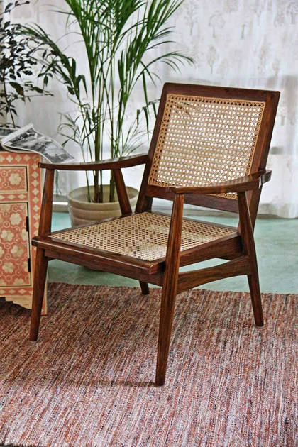
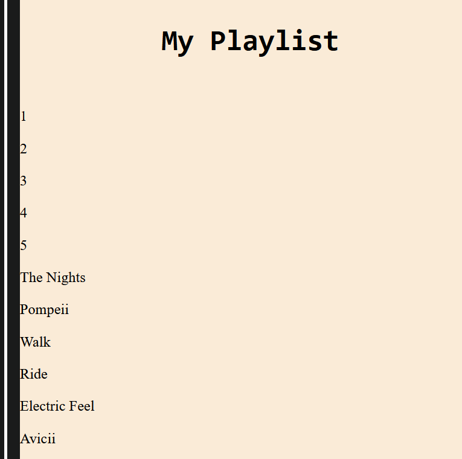
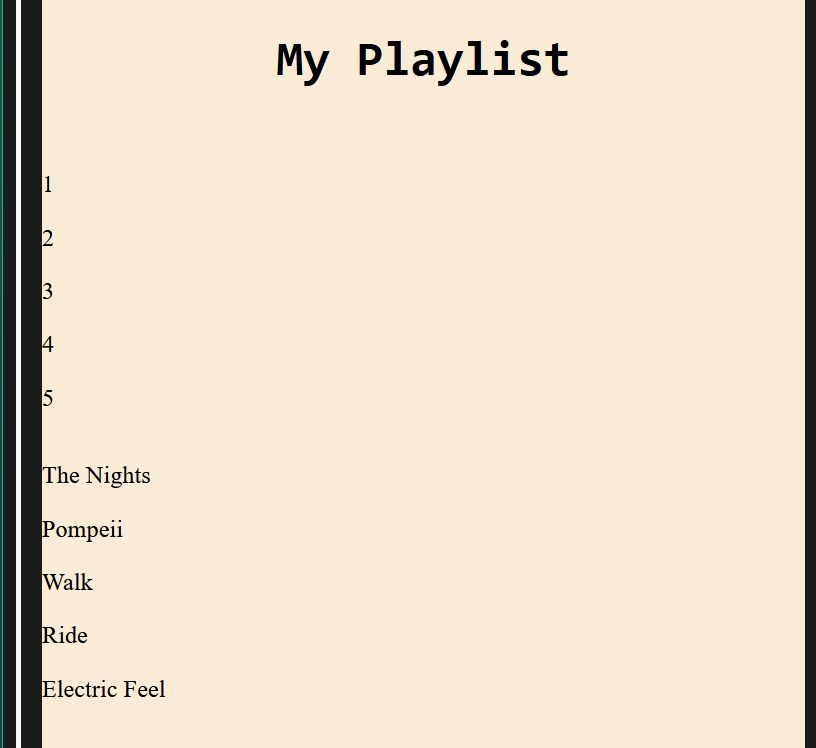
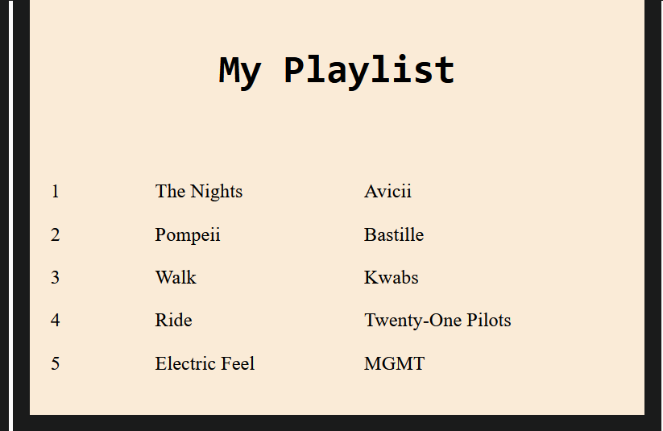
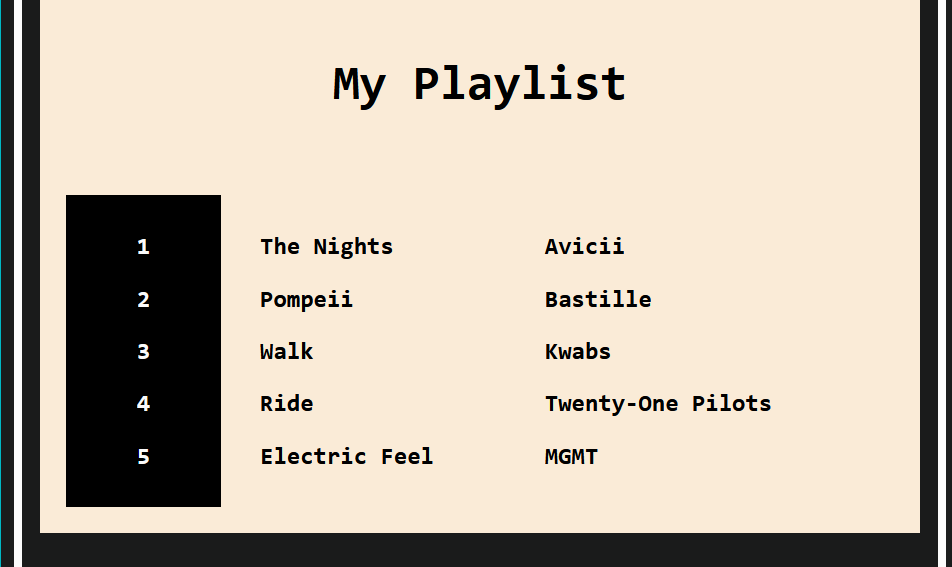
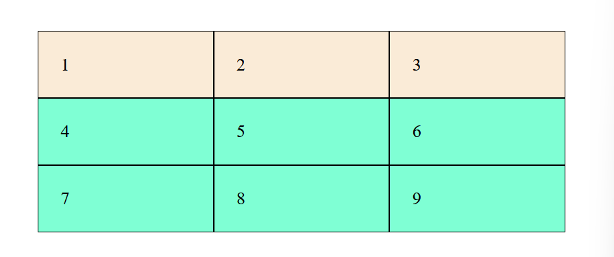
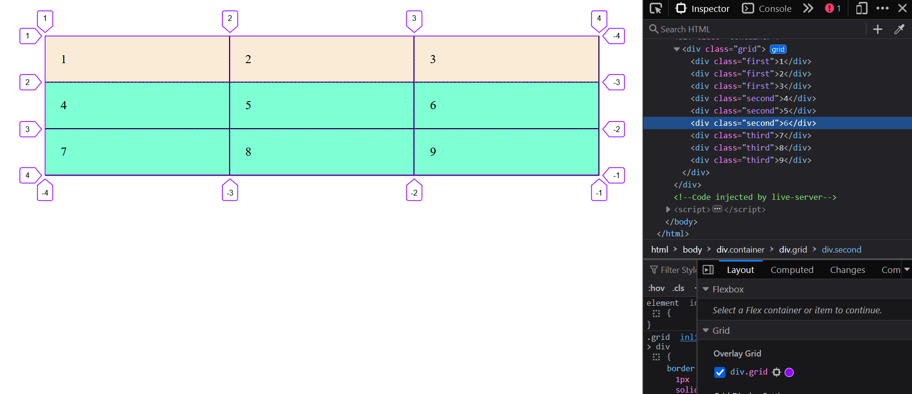

Let's learn about the grid layout...

* Table of content
{:toc}

## Grid layout

You must've seen grids in your daily life - in wickerwork, in woven chairs, tiles, etc.



Now let's get technical - a **grid** [introduced in 2017] is a group of horizontal and vertical lines creating a pattern. This typically has rows, columns and gutters [gaps].


### ``display: grid``

Now let's put this technology to practice. Let's say we wish to create our top 5 songs in Spotify...



This one looks super awkward. Let's fix it using ``display: grid`` in the `<section>` containing these songs :

```css
.list
{
    display: grid;
}
```



Nothing seems to have changed except for some minute spacing between items. That's because we've got a single column spanning across the entire page now. Let's split the items into 3 separate columns.

```css
.list
{
    padding: 1rem;
    display: grid;
    grid-template-columns: 5rem 10rem 10rem;
}
```



Let's look at our code. When dealing with complex grid layouts, it doesn't make sense to use huge units and make our life difficult than it already is.

For that, we shall look into a new unit : `fr`

```css
.list
{
    padding: 1rem;
    display: grid;
    grid-template-columns: 0.3fr 0.5fr 1fr;
}
```

This unit represents a fraction of the available space in the grid container. In short, this unit is *very flexible* and must be used in case of grids.

We shall proceed to spruce the playlist up a bit by adding background and borders.



#### Shorthand

We can set columns [or rows] and their width using this shorthand. Note that the rows or columns will have equal lengths.

```css
grid-template-columns: repeat(3, 1fr);
/*or*/
grid-template-rows: repeat(3, 1fr);
```

We can go even further with a shorter shorthand :

```css
grid-template: 1fr 1fr / 1fr 1fr 1fr;
/* it goes like : rows / columns */
```

### Types of grids

We've seen one type of grid work so far : Explicit grid.

* **Explicit grid** : Created manually
* **Implicit grid** : Extends the created grid when content is placed outside of that grid.

By default, implicit grid has `auto` sized items. If we wish to set their size manually, we use ``grid-auto-rows`` or ``grid-auto-columns``.

#### Protecting from overflow

We'll, of course, need to protect our content from overflowing. To let content enlarge or shrink as per need, we use ``minmax()``.

```css
grid-auto-columns: minmax(1rem, auto);
```

#### Tracks, lines and cells

A single row or column in a grid is called a track.



Grid lines are created implicitly whenever we create tracks. So, every track has a start and an end line, as seen below :



These lines are used to position grid items.

A cell, on the other hand, is the child of a grid container.

##### Minimum and maximum track sizes

At times, we've to deal with our content shrinking and expanding according to resolutions. To aid us are two functions :

- `min()` -> Returns the smallest of values provided.
- `max()` -> Returns the largest of values provided.

> Usually, a static unit is provided as value along with a dynamic unit like `%`, `vh`, etc.

`minmax()` lets you set the minimum and maximum size of grid tracks. Here, it makes sense to have static units.

`clamp()` does it even better - here is its syntax :

```css
clamp(minimum-size, ideal-size, maximum-size)
```

Ideally, we'd use a dynamic value for the `ideal-size` argument.

#### Start and stop

`grid-row-start` grows the content to engulf as many cells vertically as you wish. Same goes for `grid-column-start`, but for columns that'll go horizontally.

To stop, use `grid-row-stop` for rows and `grid-column-stop` for columns.

For example, by doing this...

```css
.container
{
    padding: 10px;
    display: grid;
    grid-template: repeat(3, 1fr) / repeat(3, 1fr);
    gap: 10px 10px;
    font-size: 16px;
}
.artist
{
    grid-row-start: 2;
}
.song
{
    grid-column-start: 1;
}
```

You'd get a similarly arranged grid :


#### Auto fitting and filling

`auto-fit` lets you have as many tracks as possible without overflowing the grid container.

When there's more space and less items, `auto-fit` sizes the cells to the maximum size while `auto-fill` scales them down to the minimum size.
