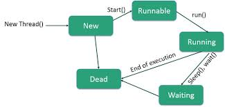

Just notes. Nothing to see here

* Table of content
{:toc}

## Java

### Unit 2

**Design a calculator to perform basic arithmetic operations using switch case statement. The menu should include options add, subtract, multiply, divide and exit. Use do while loop to repeat the menu until the user enters 0 to exit.**

Here's our logic :

```md
1. show user options
2. get numbers from user
3. enter do-while and get choice from user
4. if choice==0, exit loop
5. if choice!=0, enter switch
6. have try catch for divide by zero exception and just print output as it is for everything else
```

```java
import java.util.*; //import everything

public class calculator
{
    public static void main(String[] args)
    {
        //bring out them objects
        Random rand = new Random();
        Scanner scan = new Scanner(System.in);

        //greet people because why not
        System.out.println("Welcome to our calculator program!");
        int custNum = rand.nextInt(100000);
        System.out.println("You are our " + custNum + "th customer. Please feel free to view our services.");
        System.out.println("""
        1. Add
        2. Subtract
        3. Multiply
        4. Divide
        0. Exit
        """);

        System.out.println("Now please do enter the numbers you'll use for the operations.");
        System.out.println("First number:");
        int first = scan.nextInt();
        System.out.println("Second number:");
        int second = scan.nextInt();

        int choice;
        do
        {
            System.out.println("Enter a choice: ");
            choice = scan.nextInt();

            switch (choice)
            {
                case 1:
                    System.out.println(first + second);
                case 2:
                    System.out.println(first - second);
                case 3:
                    System.out.println(first * second);
                case 4:
                    try
                    {
                        System.out.println(first / second);
                    }
                    catch (Exception e)
                    {
                        System.out.println("Goddammit, you're NOT SUPPOSED TO DIVIDE BY ZERO!");
                    }
                default:
                    break;
            }
        }
        while(choice!=0);
    }
}
```

**Write a Java Program to find the factorial of a number and to display Fibonacci series**

```java
import java.util.*;

public class fact
{

    public static int returnFactorial(int number)
    {
        if (number==0 || number==1)
        {
            return 1;
        }
        return number * returnFactorial(number - 1);
    }

    public static void returnFibonacciSeries(int range)
    {
        ArrayList <Integer> fiboStorage = new ArrayList<>();

        int n1 = 0;
        int n2 = 1;
        
        for (int i=0; i<=range; i++)
        {
            fiboStorage.add(n1);
            int nthTerm = n1+n2;
            n1 = n2;
            n2 = nthTerm;
        }
        System.out.println("Fibonacci series: " + fiboStorage);
    }
    
    public static void main(String[] args)
    {
        //here be objects
        Scanner scan = new Scanner(System.in);

        System.out.println("""
            We can either find out your number's factorial,
            or retrieve the fibonacci series till any point
            you wish.
        """);

        System.out.println("""
         1. Get factorial of number
         2. Get fibonacci series    
         0. Exit
        """);

        System.out.println("Enter your choice: ");
        int choice = scan.nextInt();

        switch (choice)
        {
            case 1:
                System.out.println("Enter the number:");
                int factInput = scan.nextInt();
                System.out.println(returnFactorial(factInput));
                break;
            case 2:
                System.out.println("How many numbers in the series?");
                int fibbedRange = scan.nextInt();
                returnFibonacciSeries(fibbedRange);
            case 3:
                System.exit(0);
        }
    }
}
```

Or if we want to reduce some code...

```java
public static int returnFactorial(int number)
{
    return (number==0 || number==1 ? 1 : number * returnFactorial(number - 1));
}
```

**Illustrate method overloading and design the methods to calculate area of circle, square, rectangle and triangle using Java Code**

```java
import java.util.*;

public class shapeOfYou
{
    static int getArea(int side)
    {
        return side*side;
    }
    //rectangle
    static int getArea(int length, int breadth)
    {
        return length*breadth;
    }
    //circle
    static double getArea(double radius)
    {
        return (Math.PI*radius*radius);
    }
    //triangle
    static double getArea(double base, double height)
    {
        return (base*height)/2;
    }

    public static void main(String[] args)
    {
        System.out.println("Areas given below");
        System.out.println("Square: " + getArea(10));
        System.out.println("Rectangle: " + getArea(12, 23));
        System.out.println("Circle: " + getArea(13.5));
        System.out.println("Triangle: " + getArea(13.4, 22.3));
    }
}
```

If, in case, we need to get the input from our user...

```java
import java.util.*;

public class shapeOfYou
{
    //...

    public static void main(String[] args)
    {
        Scanner scan = new Scanner(System.in);

        System.out.println("""
        1. Square
        2. Rectangle
        3. Circle
        4. Triangle
        """);
        System.out.println("Which area would you like to get?");
        int choice = scan.nextInt();

        switch (choice)
        {
            case 1:
                System.out.println("Side of the square");
                int side = scan.nextInt();

                System.out.println(getArea(side));

                break;

            case 2:
                System.out.println("Length");
                int length = scan.nextInt();
                System.out.println("Breadth");
                int breadth = scan.nextInt();

                System.out.println(getArea(length, breadth));

                break;

            case 3:
                System.out.println("Radius");
                double radius = scan.nextInt();

                System.out.println(getArea(radius));

                break;

            case 4:
                System.out.println("Base");
                double base = scan.nextInt();
                System.out.println("Height");
                double height = scan.nextInt();

                System.out.println(getArea(base, height));

                break;

            default:
                break;
        }
    }
}
```

**What are the uses of the final keyword in inheritance?**

Modifiers change something in variable, class, methods, etc.

`final` prevents value to be changed in attributes and methods. Works like `const` in JS. In case of inheritance, doesn't allow class to be inherited by other classes.

**What are abstract classes?**

A class that can't be used to create objects [this means no instances, nothing]. However, it can have constructors and such.

**What is method overriding?**

Using inheritance, we've derived a child class [subclass] from an existing class [superclass]. This child inherits properties from its parent.

If a method is common in both the parent and child classes, the subclass method overrides the superclass method.

**What is the use of this super keyword?**

`super` is used to refer to superclass [parent class] objects from a subclass [child class]. It prevents method overriding.

**List the types of inheritances.**

Single, multilevel, hierarchical, hybrid

**What are static methods?**

Methods that are a part of the class rather than an instance of that class [i.e. object]. They can be accessed using the class name.

**Write a Java program to find the average rainfall in a city. The data collected from different locations in the city should be entered by the user. Display the average rainfall rate.**

```java
import java.util.*;

public class rainfall
{
    public static void main(String[] args)
    {
        //import them!
        ArrayList <Double> rainFall = new ArrayList<>();
        Scanner scan = new Scanner(System.in);
        
        //ask user
        double sum = 0;
        while (true)
        {
            System.out.println("Enter the rainfall at a location in the city");
            sum += scan.nextDouble();
            rainFall.add(scan.nextDouble());

            System.out.println("Add more? [0 to stop] [1 to add]");
            int choice = scan.nextInt();
            if (choice==0) break;
            else continue;
        }

        System.out.println("Average rainfall: " + sum / (double) rainFall.size());
    }
}
```

**Write a Java program to display the prime numbers below 100**

Remember this logic : A prime number is only divisible by one and itself

### Unit 3

#### **What is a package?**

Container group of similar types of classes, interfaces and sub-packages. Uses encapsulation.

#### **Illustrate with an example for built in package.**

`java.io` package

```java
import java.io.Console;

public class pack
{
    public static void main(String[] args)
    {
        Console log = System.console();

        System.out.println("Who are you?");
        String me = log.readLine();
        System.out.println("I'm " + me);
    }
}
```

#### **What is use of throw statement? Give an example?** && **Write the syntax of exception.** && **Write a Java program to handle the exception divide by zero.** && **Demonstrate user defined exception with an example.**

`throw` is used to return an exception from a method or any block of code. This exception can must either be declared with the keyword [and is expected], or is unexpected.

```java
//...
        try
        {
            System.out.println("First number");
            int a = scan.nextInt();
            System.out.println("Second number");
            int b = scan.nextInt();

            if (b==0)
            {
                throw new ArithmeticException("Can't divide by zero");
            }
            System.out.println(a/b);
        }
        catch (Exception e)
        {
            System.out.println("Caught inside main()");
            throw e;
        }
//...
```

#### **List any three common run time errors.**

ArrayIndexOutOfBoundsException : Array element that doesn't exist is accessed

ArithmeticException : Dividing by zero

NegativeArraySizeException : Array size is negative

#### **Compare interface and abstract class.** && **How interface is implemented in Java?** && **Recall interface.**

Interface is a blueprint for classes. It is a description of a set of methods that the said classes must have. In short, it is like a contract.

All its methods are abstract [don't declare them with `abstract`]. No static methods allowed.

However, all variables defined must be `static` AND `final`.

```java
interface pack
{
    final String[] list = {"Good Grief", "Riptide", "Mar Azul", "L'Amour", "Beetlebum"};
    void getSongs();
}

class music implements pack
{
    public void getSongs()
    {
        for (int i=0; i<list.length; i++)
        {
            System.out.println(list[i]);
        }
    }

    public static void main(String[] args)
    {
        music gimmeSomeSong = new music();
        gimmeSomeSong.getSongs();
    }
}

```

Abstract class is a class that can't be used to create objects [this means no instances, nothing]. However, it can have constructors and such.

#### **What is the use of finally block?**

Block of code that's ALWAYS executed after `try` block even if any exception occurs.

#### **What are the access specifiers in Java?** && **State the use of protected access specifier?**

Default
Private : Only available to that class
Public : Available everywhere
Protected : Only available to that package

#### **Mention the use of final keyword.**

Modifiers change something in variable, class, methods, etc.

`final` prevents value to be changed in attributes and methods. Works like `const` in JS. In case of inheritance, doesn't allow class to be inherited by other classes.

#### **Describe the levels of access protection available for packages.**

The levels available are `public`, `protected` and no modifiers.

Default : Access is only within the package, can't be accessed from outside. This is set if you don't specify any access level. More restrictive than `protected` and `public`.

```java
package Study.what;

public class everything
{
    void cry()
    {
        System.out.println("WAHHHHHH");
    }
}
```

`public` : Access is everywhere. You can access this member within a class, outside a class and within a package, and outside the package.

```java
package Study.what;

public class everything
{
    public void cry()
    {
        System.out.println("WAHHHHHH");
    }
}
```

`protected` : Access is similar to default. It can be accessed outside only via a child class [obtained via inheritance]. Can only be applied to data member, methods, constructor and never to classes.

```java
package Study.what;

public class everything
{
    protected void cry()
    {
        System.out.println("WAHHHHHH");
    }
}
```

#### **Discuss the different ways to create an interface in java with an example**

Interface is a blueprint for classes. It is a description of a set of methods that the said classes must have. In short, it is like a contract.

All its methods are abstract [don't declare them with `abstract`]. No static methods allowed. However, all variables defined must be `static` AND `final`.

Standard way :

```java
interface spotify
{
    final String[] list = {"Good Grief", "Riptide", "Mar Azul", "L'Amour", "Beetlebum"};
    void getSongs()
    {
        for (int i=0; i<list.length; i++)
        {
            System.out.println(list[i]);
        }
    }
}
```

Marker interface [interface without methods]

```java
interface Remote
{}
```

Functional interface [only one abstract method]

```java
@FunctionalInterface
interface spotify
{
    void orderByArtist(ArrayList<String> list);
}
```

#### **Explain how to create user defined package in java with example.**

Container group of similar types of classes, interfaces and sub-packages. Uses encapsulation [explain encapsulation].

We can simply create user-defined packages by defining package name [derived from directory tree location] and placing related classes in it.

```java
package Study;

public class Circle
{
    private double radius;

    public Circle(double radius)
    {
        this.radius = radius;
    }

    public double getArea()
    {
        return Math.PI * radius * radius;
    }
}

public class Main
{
    public static void main(String[] args)
    {
        Circle circle = new Circle(5);

        System.out.println("Area of the circle: " + circle.getArea());
    }
}
```

#### **Create an interface to book bus ticket with two method bus_details and booking. Use two classes to implement the methods in the interface.**

We are going to have a class that contains our bus details :

Route Number : Use RNG
From place and To place
Journey hours
Journey date : Set as today
Total km

Then another class to hold the booking details :

Passengers in total
Passenger name : Set in arraylist
Fare

Now these are our interfaces...

```java
import java.util.ArrayList;

interface ECRTC //elysium city rtc
{
    int getRouteNumber();
    String getArrival();
    String getDestination();
    double getTravelTime();
    double getDistance();

    void displayBusTicket();
}

public class bus implements ECRTC
{
    private int routeNumber;
    private String arrival;
    private String destination;
    private double travelTime;
    private double distance;

    public bus (int routeNumber, String arrival,
    String destination, double travelTime,
    double distance)
    {
        this.routeNumber = routeNumber;
        this.arrival = arrival;
        this.destination = destination;
        this.travelTime = travelTime;
        this.distance = distance;
    }

    public int getRouteNumber() {
        return routeNumber;
    }

    public String getArrival() {
        return arrival;
    }

    public String getDestination() {
        return destination;
    }

    public double getTravelTime() {
        return travelTime;
    }

    public double getDistance() {
        return distance;
    }

    public void displayBusTicket()
    {
        String printThis = String.format("""
        Route number: %d
        Arrival: $s
        Destination: %s
        Travel Time: %f
        Distance: %f       
        """, getRouteNumber(), getArrival(), getDestination(), getTravelTime(), getDistance());
        System.out.println(printThis);
    }
}
```

```java
interface ECRTCBooking
{
    int getPassengerCount();
    ArrayList<String> getPassengers();
    double getFare();
    double getProtectionMoney();

    void displayBookingDetails();
}

public class booking implements ECRTCBooking
{
    private int count;
    private ArrayList <String> names;
    private double fare;
    private double protectionMoney;

    public booking(int count,
    ArrayList<String> names, double fare,
    double protectionMoney)
    {
        this.count = count;
        this.names = names;
        this.fare = fare;
        this.protectionMoney = protectionMoney;
    }

    public int getPassengerCount()
    {
        return count;
    }
    public ArrayList<String> getPassengers()
    {
        return names;
    }
    public double getFare()
    {
        return fare;
    }
    public double getProtectionMoney()
    {
        this.protectionMoney = this.fare / 4;
        return protectionMoney;
    }
    
    public void displayBookingDetails()
    {
        System.out.println("Passengers: " + this.count);
        for (int i=0; i<=this.names.size(); i++)
        {
            System.out.println(this.names.get(i));
        }
        System.out.println("Total fare: " + this.fare + this.protectionMoney);
    } 
}
```

#### **Write a package program to calculate EMI. Use parameterized constructor to pass amount,rate of interest and number of methods.**

We're creating a class with these instance variables :

Principal amount
Rate of interest
Years [Loan tenure]

This would come with getters and then a method to calculate EMI with a formula

So let's get started :

```java
package Study.what;

class emi
{
    private double amount;
    private double interest;
    private int tenure;

    public emi (double amount, double interest, int tenure)
    {
        this.amount = amount;
        this.interest = interest;
        this.tenure = tenure;
    }

    public double getAmount()
    {
        return this.amount;
    }
    public double getInterest()
    {
        return this.interest;
    }
    public int getTenure()
    {
        return this.tenure;
    }

    public double calculateEMI(double amount, double interest, int tenure)
    {
        double emiInterest = 1 + this.interest;
        double emiPartOne = this.amount*this.interest;
        double emiPartTwo = (Math.pow(emiInterest, this.tenure));
        double emiPartThree = Math.pow(emiInterest, (this.tenure - 1));

        return ((emiPartOne*emiPartTwo)/emiPartThree);
    }
}
```

#### **Write a package program to calculate discount in a textile shop. Use parameterized constructor to initialize the amount of purchase. Assume necessary conditions for discount**

```java
package pack;

class discount
{
    private String item;
    private double price;
    private double discount;

    public discount(String item, double price)
    {
        this.item = item;
        this.price = price;
    }

    public double getPrice()
    {
        return this.price;
    }

    public double calculateDiscount(double price)
    {
        if (price>=750)
        {
            this.discount = 50;
            //50% off on purchase of 750 and above!
            double discountedAmount = this.price * (this.discount / 100);
            return (price - discountedAmount);
        }
        return price;
    }
}

public class shop
{
    public static void main(String[] args)
    {
        discount shopping = new discount("Nike", 1000);
        System.out.println(shopping.calculateDiscount(shopping.getPrice()));
    }
}
```

#### **Explain the implementation of interfaces. Mention the advantages and disadvantages of interfaces.**

Interface is a blueprint for classes. It is a description of a set of methods that the said classes must have. In short, it is like a contract.

All its methods are abstract [don't declare them with `abstract`]. No static methods allowed. However, all variables defined must be `static` AND `final`.

Standard way :

```java
interface spotify
{
    final String[] list = {"Good Grief", "Riptide", "Mar Azul", "L'Amour", "Beetlebum"};
    default void getSongs()
    {
        for (int i=0; i<list.length; i++)
        {
            System.out.println(list[i]);
        }
    }
}
```

Marker interface [interface without methods]

```java
interface Remote
{}
```

Functional interface [only one abstract method]

```java
@FunctionalInterface
interface spotify
{
    void orderByArtist(ArrayList<String> list);
}
```

Advantages :

- Interfaces are mainly used to provide polymorphic behavior.
- Interfaces function to break up the complex designs and clear the dependencies between objects.
- It separates what the caller expects from the implementation. You have a pure set of methods you can call without any knowledge of the implementation.
- An interface allows you to guarantee that certain methods exist and return the required types.

Disadvantages :

- Java interfaces are slower and more limited than other ones.
- Interfaces expose their member variables since they must be public.
- Since an interface can be thought of as a contract implemented by multiple classes, in certain cases, modifying the interface could lead to unpredictable behavior for the classes implementing them
- Interface should be used multiple number of times else there is hardly any use of having them.

### Unit 4

#### **Define the term thread.**

- Thread is a set of actions that are executed one after the other.
- These instructions are managed independent of the program by a scheduler.
- They're a part of a process.

#### **List the different states of Thread in Java**

- NEW : Not yet started execution
- TERMINATED : Completed execution
- WAITING : Waiting for another thread to finish executing
- RUNNABLE : Waiting for resource allocation
- BLOCKED : Waiting to obtain permission to enter a synchronized block

#### **Explain Thread Priority?**

Each thread has a number [between 1 and 10] assigned to it. This number is called its priority.

Scheduler arranges execution of threads according to their priority. Default priority is 5. Minimum is 1, maximum is 10.

#### **What is Thread Synchronization?**

Only one thread is executed at a time. Other threads remain in the WAITING state. It's used to avoid unnecessary interferences in thread execution.

#### **With a diagram explain Thread Life Cycle.**



#### **Write a thread to display even integers from 0 to 10 and the second thread to display odd integers from 1 to 11.**

```java
public class takeMeToChurch
{
    public static void main(String[] args)
    {
        Thread even = new Thread()
        {
            public void run()
            {
                for (int i=0; i<=10; i+=2)
                {
                    System.out.println("Even: " + i);
                }
            }
        };

        Thread odd = new Thread()
        {
            public void run()
            {
                for (int i=1; i<=11; i+=2)
                {
                    System.out.println("Odd: " + i);
                }
            }
        };
        
        even.start();
        odd.start();
    }
}
```

Or even simpler

```java
import java.util.stream.*;

public class takeMeToChurch
{
    public static void main(String[] args)
    {
        Thread even = new Thread(() ->
        IntStream.rangeClosed(0, 10)
        .filter(i -> i%2==0)
        .forEach(i -> System.out.println("Even: " + i)));

        Thread odd = new Thread(() ->
        IntStream.rangeClosed(1, 11)
        .filter(i -> i%2!=0)
        .forEach(i -> System.out.println("Odd: " + i)));
         
        even.start();
        odd.start();
    }
}
```

`IntStream.rangeClosed()` is used to imitate a for loop from [0 to 10 for even; 1 to 11 for odd].

Then we use `filter` to set a condition and then check that condition for every single number in range using `forEach()`.

#### **Define multithreading?**

Splitting a process into multiple independent threads and allowing the program to process many tasks at the same time.

Process : A program's instance
Thread : Sub-processes of a process

[A program's instance [a way it manifests into the OS] is called a process. This process has several sub-processes in it which are also known as threads.]

#### **List out the advantages of multithreading.**

- Improved performance
- Better resource utilization
- Simplified program structure
- Reduces freezing or crashing in applications, etc.
- Modularity

#### **With an example explain the concept of Multithreading.**

```java
import java.util.*;

public class factAndFibonacci
{
    public static void main(String[] args)
    {
        Scanner scan = new Scanner(System.in);

        Thread fact = new Thread(() ->
        {
            System.out.println("Number:");
            int num = scan.nextInt();
            long factorial = 1;

            for (int i=1; i<=num; i++)
            {
                factorial*=i;
            }
            System.out.println(factorial);
        });

        Thread fibo = new Thread(() ->
        {
            System.out.println("How many fibonacci numbers do you want?");
            int count = scan.nextInt();
            int first = 0;
            int second = 1;
            String sequence = "";

            for (int i=1; i<=count; i++)
            {
                sequence += first + " ";
                int sum = first + second;
                first = second;
                second = sum;
            }
            System.out.println(sequence);
        });

        fact.start();
        fibo.start();
    }
}
```

#### **State the use of Alive() method?**

`isAlive()` is used to find out if a thread is alive [has been started] or is dead [is terminated].

It returns `true` if thread's alive and `false` if it's terminated.

#### **What is join() method?**

`join()` ensures that the calling thread waits until the thread whose `join()` method is called has finished executing.

#### **Write short notes on input and output stream.**

`OutputStream` is an abstract class whose subclasses are used to write data to destinations. `FileOutputStream`, `ByteArrayOutputStream` and `ObjectOutputStream` are some of its sub-classes.

To create an output stream, we must import the `java.io.OutputStream` package. We can't just instantiate from `OutputStream` as it is an abstract class.

```java
OutputStream object = new FileOutputStream();
```

`InputStream` is an abstract class whose subclasses are used to read data. `FileInputStream`, `ByteArrayInputStream` and `ObjectInputStream` are some of its sub-classes.

To create an input stream, we must import the `java.io.InputStream` package. We can't just instantiate from `InputStream` as it is an abstract class.

```java
InputStream object = new FileInputStream();
```

#### **Illustrate file input stream and file output stream with an example.**

A stream is a sequence of data read from a source and written to a destination. In Java, both the streams use the `java.io` package that can be imported using ``import java.io.*;` statement.

`OutputStream` is an abstract class whose subclasses are used to write data to destinations. `FileOutputStream`, `ByteArrayOutputStream` and `ObjectOutputStream` are some of its sub-classes.

To create an output stream, we must import the `java.io.OutputStream` package. We can't just instantiate from `OutputStream` as it is an abstract class.

```java
OutputStream object = new FileOutputStream();
```

`System.out` is the standard output stream. Output stream is used to write data to a destination.

```java
String lyrics = """
    He said, "One day, you'll leave this world behind\n
    So live a life you will remember"\n
    My father told me when I was just a child\n
    "These are the nights that never die"\n
    My father told me.      
""";
try
{
    FileOutputStream output = new FileOutputStream("output.txt");
            
    byte[] bytes = lyrics.getBytes();
    output.write(bytes);

    output.close();
}
```

`InputStream` is an abstract class whose subclasses are used to read data. `FileInputStream`, `ByteArrayInputStream` and `ObjectInputStream` are some of its sub-classes.

To create an input stream, we must import the `java.io.InputStream` package. We can't just instantiate from `InputStream` as it is an abstract class.

```java
InputStream object = new FileInputStream();
```

`System.in` is the standard input stream. Input stream is used to read data from a source.

```java
FileInputStream input = new FileInputStream("text.txt");

int i = input.read();

String str = "";
while (i!=-1)
{
    str += (char) i;
    i = input.read();
}

System.out.println(str);
input.close();
```

#### **Write a Java Program to display the contents of a file.**

```java
import java.io.*;

public class everlasting
{
    public static void main(String[] args)
    {
        try
        {
            FileInputStream input = new FileInputStream("text.txt");
            
            int i = input.read();

            String str = "";
            while (i!=-1)
            {
                str += (char) i;
                i = input.read();
            }
            System.out.println(str);
            input.close();
        }
        catch (Exception e)
        {
            System.out.println("Error");
        }
    }
}
```

Or even more simpler

```java
import java.io.*;
import java.nio.charset.*;

public class everlasting
{
    public static void main(String[] args) throws Exception
    {
        FileInputStream input = new FileInputStream("text.txt");

        String lyrics = new String(input.readAllBytes(), StandardCharsets.UTF_8);
        System.out.println(lyrics);
        input.close();
    }
}
```

`input.readAllBytes()` lets you read the bytes in the file. `StandardCharsets` converts the said bytes to the format we've specified - `UTF_8`.

Then we simply print the lyrics.

#### **Using an example explain isAlive() method and Join () method.**

`isAlive()` is used to find out if a thread is alive [has been started] or is dead [is terminated]. It returns `true` if thread's alive and `false` if it's terminated.

`join()` ensures that the calling thread waits until the thread whose `join()` method is called has finished executing.

```java
public class main
{
    public static void main(String[] args)
    {
        Thread t1 = new Thread(() ->
        {
            try   
            {  
                Thread.sleep(300);  
                System.out.println(Thread.currentThread().isAlive());  
            }  
            catch (InterruptedException ie){}
        });

        Thread t2 = t1;
        
        t1.start();
        try
        {
            t1.join();
        }
        catch (Exception e){}
        t2.start();
    }
}
```

#### **Write a Java Program on Multithreading to display factorial and Fibonacci**

```java
import java.util.*;

public class factAndFibonacci
{
    public static void main(String[] args)
    {
        Scanner scan = new Scanner(System.in);

        Thread fact = new Thread(() ->
        {
            System.out.println("Number:");
            int num = scan.nextInt();
            long factorial = 1;

            for (int i=1; i<=num; i++)
            {
                factorial*=i;
            }
            System.out.println(factorial);
        });

        Thread fibo = new Thread(() ->
        {
            System.out.println("How many fibonacci numbers do you want?");
            int count = scan.nextInt();
            int first = 0;
            int second = 1;
            String sequence = "";

            for (int i=1; i<=count; i++)
            {
                sequence += first + " ";
                int sum = first + second;
                first = second;
                second = sum;
            }
            System.out.println(sequence);
        });

        fact.start();
        fibo.start();
    }
}
```

#### **Write an Applet program to display your name.**

```java
import java.applet.*;
import java.awt.*;

public class main extends Applet
{
    public void paint(Graphics graph)
    {
        graph.drawString("I am me!", 200, 100);
    }
}
```

#### **Develop a Java Program to design a student registration page using Java AWT.**

```java
import java.awt.*;
import java.awt.event.*;

public class pissEasy extends Frame implements ActionListener
{
    //add them wee labels
    TextField nameField, ageField;
    Choice genderChoice;
    Button submit;

    //set this shit up
    public studentReg()
    {
        setTitle("Students Please Register");
        setSize(500, 500);
        setLayout(new FlowLayout());

        nameField = new TextField(50);
        genderChoice = new Choice();
        genderChoice.add("Male");
        genderChoice.add("Female");
        genderChoice.add("Transgender");
        genderChoice.add("Any other?");

        submit = new Button("Submit!");
        submit.addActionListener(this);

        add(new Label("Name: "));
        add(nameField);
        add(new Label("Gender: "));
        add(genderChoice);
        add(submit);

        addWindowListener(new WindowAdapter()
        {
            public void windowClosing(WindowEvent we)
            {
                System.exit(0);
            }
        });

        setVisible(true);

        @Override
        public void actionPerformed(ActionEvent e)
        {
            // Handle button click
            String name = nameField.getText();
            String gender = genderChoice.getSelectedItem();
            System.out.println("Registered: Name=" + name + ", Gender=" + gender);
            // Clear fields
            nameField.setText("");
            ageField.setText("");
            genderChoice.select(0);
        }
    
        public static void main(String[] args)
        {
            new StudentRegistration();
        }
    }
}
```

**What are the two ways in which a thread can be processed? Explain with an example.**

#### **List the AWT components in Java.**

- Button: A clickable button used to perform actions.
- Panel: A container for organizing components.
- TextArea: A multi-line text input field.
- Choice: A drop-down list of items.
- Menu: A menu bar that holds menus.

#### **What is the use of AWT Choice?**

The AWT Choice component in Java is a drop-down list that allows users to select one item from a list of options. Only the currently selected item is visible.

#### **How frames are created in AWT?**

- Importing `java.awt.Frame`.
- Creating a `Frame` object.
- Setting properties like size and title.
- Making it visible using `setVisible(true)`.

**Write a Java Program to design a calculator using event handling.**

**What is Byte Stream in Java?**

#### **What is Applet?**

Java application that is integrated into a webpage. It functions like a front-end and is run within the web computer. As of now, they are discontinued.

#### **What are the advantages of Applet?** && **Mention the advantages and disadvantages of Applet.**

Advantages :

- **Platform Independence:** Since applets run on a Java Virtual Machine (JVM), they are platform-independent.
- **Security:** Applets run in a sandbox environment, which provide a secure way to run code from a remote server.
- **Lightweight:** Applets are relatively lightweight as they don't require a standalone application installation.
- **Interactive:** Applets can be easily used to create interactive and dynamic web content.
- **Automatic Updates:** Applets are fetched from the server, ensuring users always have the latest version.

Disadvantages :

- **Browser Dependency:** Applets require a browser with JVM support, which is no longer common
- **Slow Loading Time:** Since applets need to download and initialize the JVM, the loading time can be longer.
- **Limited Functionality:** Applets run in a sandbox, limiting their access to system resources.
- **Security Warnings:** Due to the potential security risks, browsers often show warnings when running applets.
- **Outdated Technology**: Applet usage has declined due to the rise of JavaScript, HTML5, and CSS.

**Explain in detail about Applet life cycle.**
