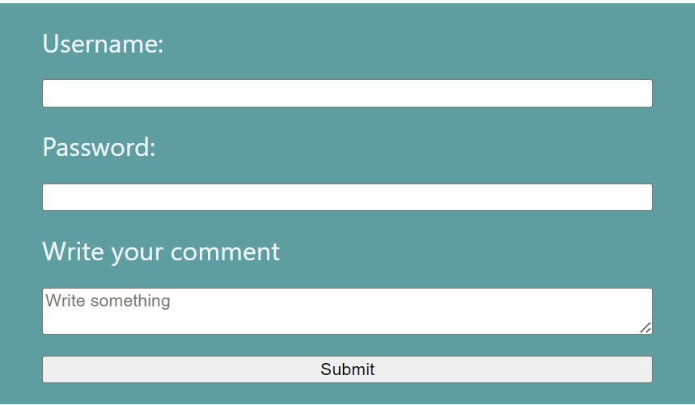
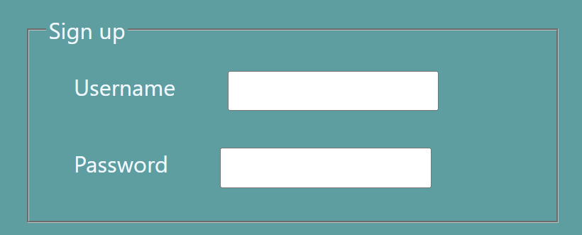
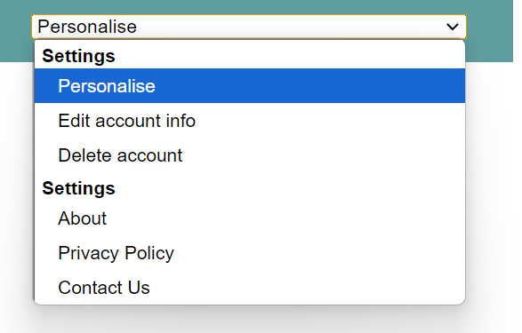

Let's learn how form content works in HTML...

* Table of content
{:toc}

## Forms in HTML

We've seen a variety of web forms in the form of newsletters, signing up, etc.

These allow users to enter information, which will be stored in a web server for processing and storage or for updating the UI.

A web form is a container that wraps all form controls [aka widgets] and other elements [known as HTML forms] on a form.

Form controls are created using the `<input>` tag.

### Creating a form

A form is created using the container tag `<form>`. This tag has the following attributes :

* `action` : Defines the URL where the form's collected data is sent
* `method` : Defines which HTTP method to send data with.

#### HTTP

HTTP [Hyper Text Transfer Protocol] defines a set of request methods to indicate 2 things :

- Purpose of the request
- What to do if the request is successful

Here are some of the requests we see :

`GET` retrieves data from a server.

`POST` modifies information in a server by submitting it [the modified parts] to the server and asking if it can proceed with it.

`PUT` replaces information in the server with another information.

`DELETE` simply deletes the resource.

> For more requests, check out the [MDN Web Docs](https://developer.mozilla.org/en-US/docs/Web/HTTP/Methods)

#### Back to our form

Now our form element will look like this :

```html
<form action="website.com/path" method="post"></form>
```

Let's add the form controls to get user input.

```html
<form>
    <label for="name">Username: </label>
    <input id="name" type="name" name="username" required>
    <label for="password">Password: </label>
    <input id="password" type="password" name="password" required>
    <label for="message"> Write your comment</label>
    <textarea rows="20" cols="60" placeholder="Write something" optional></textarea>
    <button id="btn" type="submit">Submit</button>
</form>
```

**What does what?**

`<label>` : Input asked by the field.
`for` : Takes the id of `<input>` as value; helps us associate the label with the form control
`required` : Compulsory input

`<input>` : Input to be filled by user
`type` : What kind of input will be accepted?
`name` : Tells the browser which name to give the data provided from the input field.

`<textarea>` : Lets user write a message in the field.
`rows` : Initial height of the text-box
`cols` : Initial width of the text-box
`placeholder` : Initial text that'll fade away as soon as you start typing in the text box
`optional` : Optional input; can be left blank

`<button>` : Button to submit the form



##### Button types

There are 3 types for the button element :

`type="submit` sends the form input to a server.

`type="reset"` resets the form.

`type=button` is generic and any function can be added to it using JS.

#### Okay, but why do we need `name`?

This is an example to demonstrate why we need the `name` and other attributes [I've only included what's necessary]:

```json
{
 //... 
  "form":
  {
    "password": "pass", //check this out
    "username": "user" //and this
  }, 
  //...
}
```

### Other form elements

``<fieldset>`` element is a way to group form controls together for styling purposes. This element has a special label called `<legend>`.

```html
<form>
    <fieldset>
        <legend>Sign up</legend>
        <label for="name">Username</label>
        <input type="name" name="username" id="name">
        <label for="password">Password</label>
        <input type="password" name="password" id="password">
    </fieldset>
</form>
```



`select` element renders a dropdown list where users can select an option. `selected` lets one `<option>` element be the default value :

```html
<select>
    <option value="about" selected>About</option>
    <option value="privacy-policy">Privacy Policy</option>
    <option value="contact-us">Contact Us<option>
</select>
```

Combine this with `<optgroup>` that lets you arrange `<option>` into different categories :

```html
<select>
    <optgroup label="Settings">
        <option value="personalise">Personalise</option>
        <option value="edit_account_info">Edit account info</option>
        <option value="delete_account">Delete account</option>
    </optgroup>
    <optgroup label="Settings">
        <option value="about">About</option>
        <option value="privacy-policy">Privacy Policy</option>
        <option value="contact-us">Contact Us</option>
    </optgroup>
</select>
```

And we get this :



#### Pseudo-selectors

`::placeholder` -> Styles the placeholder

`:placeholder-shown` -> Styles placeholder only when it's shown

`:valid` -> Styles input if it's correct [like green box]

`:invalid` -> Styles input if it's incorrect [like red box]
