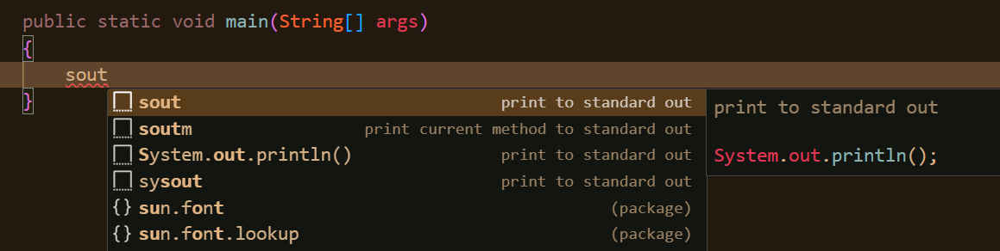

We shall now learn to create and use snippets...

* Table of content
{:toc}

## Emmet

Emmet is VSCode's built-in plugin that assists you in 2 ways :

- Providing you shortcuts to do stuff [for example, ctrl+/ allows you to comment].
- Suggesting parts of code as you type.

One part of Emmet abbreviation [the suggestion stuff done by emmet] is snippet.

### Snippets

Snippets are suggestions that appear when you type in your program file.

These are a couple of snippets in Java :



These are some more in JavaScript :


They reduce the amount of time one takes to make a working program [no need to waste time on stuff that don't matter. Time is precious, after all].

One such example is the snippet I created myself for HTML boilerplate :

```json
"HTML Boilerplate":
	{
		"prefix": "!",
		"body":
		[
			"<!DOCTYPE html>",
      		"<html lang=\"en\">",
      		"<head>",
      		"    <meta charset=\"UTF-8\">",
      		"    <meta name=\"viewport\" content=\"width=device-width, initial-scale=1.0\">",
      		"    <meta http-equiv=\"X-UA-Compatible\" content=\"ie=edge\">",
      		"    <title>${1:Document}</title>",
			"    <link rel=\"stylesheet\" href=\"\">",
      		"</head>",
      		"<body>",
			"    <div class=\"container\">",
      		"    ${0}",
			"    </div>",
			"    <script src=\"\" defer></script>",
      		"</body>",
      		"</html>"
		],
		"description": "HTML Boilerplate"
	}
```

If you look closely, the code is set in this specific format :

```json
"Name of Snippet":
	{
		"prefix": "Key or word by which the suggestion will appear",
		"body":
		[
			//body of the snippet
		],
		"description": "What does the snippet do?"
	}
```

How do we create snippets? Follow the steps below :

- Hit `ctrl+shift+p` to get the command palette. If not, go to View and then click Command Palette.
- Type configure snippets and hit enter.
- Now type html. You'll get an option for `html.json`. Again hit enter.
- Paste the above code in that file and save it.

If you want to know the full list of Emmet abbreviations, check out [this website](https://docs.emmet.io/cheat-sheet/).

From it, here's an example :


And voila!

