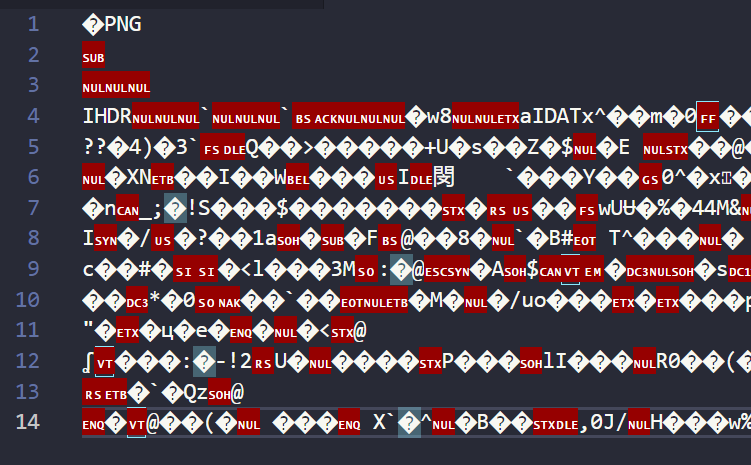

We shall now learn to create vectors...

* Table of content
{:toc}

## Vector Graphics

Before learning about SVGs, let's find out what are vector graphics.

**Vector graphics** are images that are formed from mathematical equations [points, lines, shapes, etc. in a graph - think Desmos].

This is an example of a vector image from Coreldraw website :


The other type of image is **raster**. They're your regular images that are created using a grid of coloured pixels.

> Artworks, digital photos, etc. are usually raster.

They've the advantage of not pixelating [blurring or reduction in quality of image] unlike raster, whose level of detail is limited to the size of the grid [you've to increase its size to get more detail].

### SVG

SVG [Scalable Vector Graphics] is an XML-based markup language to describe 2D vector graphics.

Hold on, what's XML?

#### XML

Before that, I'd like to tell you about what a markup language is.

A **markup language** is a set of instructions defining how a document is laid out and how its content is presented. It also defines the relationships between different parts of the document using symbols and tags.

**XML [eXtensible Markup Language]** is a markup language just like Hyper Text Markup Language [or simply HTML].

It was designed to store and manage data, and to be human-readable. For example, look at this :

```xml
<quote>
    <begin>
        “We are the dead,” he said.
    </begin>
    <continue>
        “We are the dead,” echoed Julia dutifully.
    </continue>
    <end>
        “You are the dead,” said an iron voice behind them.
    </end>
<quote>
```

> Unlike HTML, XML simply carries data. Something has to work alongside to perform actions with that data.

#### SVG with XML

Now that we're clear about XML, let's go back to our topic.

Let's try opening this home icon svg file in VSCode...

```xml
<svg xmlns="http://www.w3.org/2000/svg"
height="24px" viewBox="0 -960 960 960"
width="24px" fill="undefined">
<path d="M240-200h120v-240h240v240h120v-360L480
-740 240-560v360Zm-80 80v-480l320-240 320 240v480H520v-240h
-80v240H160Zm320-350Z"/></svg>
```

And now if we do the same for its png version...



It's all binary!

This is where XML rocks, you can throw it into a HTML file and it will render properly, plus you can manipulate them in CSS and JS DOM just like any other element. Whereas, you'll need to make adjustments if any other format is used.

Well there's just one drawback - it is inefficient at storing complex images. You'll need raster for these.

#### Looking into an SVG

```xml
<svg xmlns="http://www.w3.org/2000/svg" height="24px" viewBox="0 -960 960 960" width="24px" fill="undefined"><path d="M240-200h120v-240h240v240h120v-360L480-740 240-560v360Zm-80 80v-480l320-240 320 240v480H520v-240h-80v240H160Zm320-350Z"/></svg>
```

`xmlns` -> XML NameSpace; specifies the dialect of XML we use. The one we use is `w3.org/2000/svg`.

`viewBox` -> Defines the boundary, aspect ratio and origin of the SVG.

### SVG properties

`<defs>` -> Stores graphical objects that'll used later. To display these objects, you reference them using `<use>`.

`<use>` -> Takes nodes from the document and duplicates them.

`<g>` -> Groups SVG elements

`<path>` -> Defines the shape of graphic

### Linking SVG

There are 2 ways by which you can embed SVGs in your document :

- HTML `` element
- CSS `background-image: url()`;
- Pasting the XML content directly into the HTML file. Works best with tools like React.

To make SVG, use [Yann Armelin's editor](https://yqnn.github.io/svg-path-editor/).

For some SVG icons, check out [Material Icons](https://fonts.google.com/icons), [Flaticon](https://www.flaticon.com/) and [Feather Icons](https://feathericons.com/).
