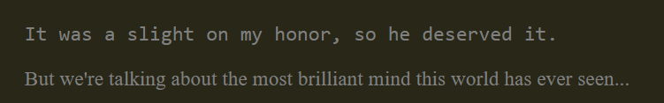

We shall now learn to put our JS into the web...

* Table of content
{:toc}

## Document Object Model

Document Object Model [shortly called DOM] is an interface that allows a programming language to manipulate a webpage's content, structure and style.

To do this, first we have to know what a document is. Consider the following HTML code :

```html
<body>
    <div class="container">
        <section class="flavour">
            <article class="text">
                <p id="head-flavour">It was a slight on my honor, so he deserved it.</p>
            </article>
            <article>
                <p id="tail-flavour">But we're talking about the most brilliant
                    mind this world has ever seen...</p>
            </article>

        </section>

        <div id="holder">
        <div id="content">
            <p class="text">I've got demons running 'round in my head</p>
            <p class="text">And they feed on insecurities I have</p>
            <p class="text">Won't you lay your healing hands on my chest?</p>
            <p class="text">Let your ritual clean</p>
        </div>
    </div>
    </div>
</body>
```

This code, along with the right stylesheet, forms the document part of a webpage. It can be accessed in JS using the `Document` object.

### Selecting elements

Let's start by selecting an element. How about the flavour-text?

```html
<article class="text">
    <p id="head-flavour">It was a slight on my honor, so he deserved it.</p>
</article>
```

#### By ID

`document.getElementById()` allows you to grab elements by their ids. Then you can assign them to variables and do whatever you'd like to do :

```js
let text = document.getElementById('head-flavour');
console.log(text);
```


The very element appeared in console! Now let's try messing around with this property, shall we?

```js
let text = document.getElementById('head-flavour');
text = "When the event happens, there is little time to think of those things that people would like to have remain private";
console.log(text);
```


#### By class

Now let's try selecting this bunch of elements :

```html
<p class="text">I've got demons running 'round in my head</p>
<p class="text">And they feed on insecurities I have</p>
<p class="text">Won't you lay your healing hands on my chest?</p>
<p class="text">Let your ritual clean</p>
```

What they do have in common is their class. So we use `document.getElementsByClassName()` to access them :

```js
let fourScore = document.getElementsByClassName('text');
console.log(fourScore);
```


This method returns the elements with the class `text` in an array-like format. So if we try to use a for-loop to print the items one-by-one, we get this


#### By tag name

Now, let's get the entire lyrics we've in here so far. I'm pretty sure they're in the `<p>` tag. So let's use `document.getElementsByTagName()` :

```js
let lyrics = document.getElementsByTagName('p');
console.log(lyrics);
```


#### Query selector

Alright. Now that we've seen how to grab an element by its ID, class and tag, we've to find a way to be specific about it.

Let's try grabbing the first line of the lyrics :

```js
let somethingGoes = document.querySelector('p');
console.log(somethingGoes);
```

Now, if we'd like to grab ALL of the lines, we'd use `document.querySelectorAll()` :

### Styling an element

When we style an element using JS, this method's called inline-styling.

Let's change the colour of our flavour text :

```js
let styleChange = document.getElementById('head-flavour');

styleChange.style.color="wheat";
```


And then the font-family of our flavour text :

```js
let styleChange = document.getElementById('head-flavour');
styleChange.style.fontFamily = "monospace";
```



> Use camelCase in JS whenever the CSS property is hyphenated

Now let's say we wish to give the lyrics a fancy aesthetic-worthy look with a monospace font. How do we do that?

```js
let styleLoop = document.getElementsByClassName('text');

for (let i = 0; i<styleLoop.length; i++)
{
    styleLoop[i].style.fontFamily = "monospace";
}
```


Reminder that this is usually how those websites that generate quotes with changeable fonts work like.

### Creating elements

Let's say we wish to add the further lyrics of the song. How do we do so?

First, we use `createElement()` to create two `<p>` elements :

```js
let newLine = document.createElement('p');
let newLineTwo = document.createElement('p');
```

Next, we assign it the class `text` so that it stays consistent with the lyrics :

```js

newLine.setAttribute('class', 'text');
newLineTwo.setAttribute('class', 'text');
```

After that, we create a text node [a node where your text stuff would go] to be inserted in these 2 tags :

```js
let newLyrics = document.createTextNode("Soak the ropes with your holy water");
let newLyricsTwo = document.createTextNode("Tie me down as you read out the words");
```

Then we simply append [or attach / insert] these two lines of the lyrics into our newly-created elements and again append them to the document body :

```js
newLine.appendChild(newLyrics);
newLineTwo.appendChild(newLyricsTwo);

document.body.appendChild(newLine);
document.body.appendChild(newLineTwo);
```


We have inserted it. yes. However, the lyrics seem rather jarringly out of the block. Let's cure that :

```js
let div = document.getElementById('holder');
div.appendChild(newLine);
div.appendChild(newLineTwo);
```


Fantastic! We've got it all right. So, to recap :

- Create element[s] using `createElement()`
- Assign the element[s] to a class or id
- Create a text node for this element[s]
- Attach text node to element[s] using `appendChild()`
- Get element from document.
- Attach created element[s] to this another element using `appendChild()`

### Modify text

Now I'm bored with the lyrics I'm currently seeing right now. Let's change the lyrics to another song, say 'Good Grief'.

```js
let prevLyrics = document.getElementById('holder');
console.log(prevLyrics.textContent);
/*
I've got demons running 'round in my head
And they feed on insecurities I have
Won't you lay your healing hands on my chest?
Let your ritual clean
*/
```

Now if we try the other options listed there...

```js
console.log(prevLyrics.innerHTML);
/*
<div id="content">
    <p class="text">I've got demons running 'round in my head</p>
    <p class="text">And they feed on insecurities I have</p>
    <p class="text">Won't you lay your healing hands on my chest?</p>
    <p class="text">Let your ritual clean</p>
</div>
*/

console.log(prevLyrics.innerText);
/*
I've got demons running 'round in my head

And they feed on insecurities I have

Won't you lay your healing hands on my chest?

Let your ritual cleans
*/
```

> `innerText` gives you the inner text with spacing. `innerHTML` gives you the HTML part of the content. `textContent` simply gives you the text part of the content and centers it in the console output.

Due to security concerns [we don't want the end-user to modify the HTML!], we'd prefer using `innerText`.

Now let's change the lyrics to Good Grief's :

```js
let prevLyrics = document.getElementById('holder');
prevLyrics.setAttribute('class', 'text');
prevLyrics.innerText = `
Caught off-guard by your favourite song

Oh, I'll be dancing at a funeral

Dancing at a funeral

Sleeping in the clothes you love

It's such a shame we had to see them burn

Shame we had to see them burn
`;
```


Wow, we really did replace the lyrics.

### Removing elements

Let's go back to our previously-previous example :

```js
let newLine = document.createElement('p');
let newLineTwo = document.createElement('p');
//...
console.log(div.innerHTML);
/*
<div id="content">
    <p class="text">I've got demons running 'round in my head</p>
    <p class="text">And they feed on insecurities I have</p>
    <p class="text">Won't you lay your healing hands on my chest?</p>
    <p class="text">Let your ritual clean</p>
</div>
<p class="text">Soak the ropes with your holy water</p>
<p class="text">Tie me down as you read out the words</p>
*/
```

Now here's the thing - what if I wish to delete the pesky div and the starting lyrics and continue the song? Well, I can - thanks to JS!

```js
let deleteThis = document.getElementById('content');
deleteThis.remove();
```


Muhahaha! I've deleted the `<div>` element. Now let's create the next set of lyrics :

```js
let lyrics = `
Set me free from my jealousy
Won't you exorcise my mind?
Won't you exorcise my mind?
I want to be free as I'll ever be
Exorcise my mind
Help me exorcise my mind
`

let nextLines = document.createElement('p');
nextLines.setAttribute('class', 'text');
let text = document.createTextNode(lyrics);
nextLines.appendChild(text);
let div = document.getElementById('holder');
div.appendChild(nextLines);
```


### Function creation

Now that we've known about this, let's create functions to make our lives easier :

```js
function createElement(tag, selector, selectorName, text, parentSelector)
{
    let element = document.createElement(tag);
    element.setAttribute(selector, selectorName);
    let content = document.createTextNode(text);
    element.appendChild(content);
    let parent = document.querySelector(parentSelector);
    parent.appendChild(element);
}

function removeElement(selector)
{
    let element = document.querySelector(selector);
    element.remove();
}

function modifyElement(selector, parentSelector, parentSelectorName, text)
{
    let element = document.querySelector(selector);
    element.setAttribute(parentSelector, parentSelectorName);
    element.innerText = text;
}
```

### Problems

Create a webpage using ONLY JS and DOM methods :

For starters, here's the boilerplate :

```html
<!DOCTYPE html>
<html lang="en">
<head>
    <meta charset="UTF-8">
    <meta name="viewport" content="width=ss, initial-scale=1.0">
    <title>Document</title>
    <script src="betting.js" defer></script>
</head>
<body>
</body>
</html>
```

> Use `<script src="fileName.js" defer></script>` to attach `.js` files to your HTML page.

```js
//div-> container
const container = document.createElement('div');
container.setAttribute('class', 'container');
document.body.appendChild(container);
document.body.style.cssText = `
font-family: monospace;
font-size: 20px;
margin: 0;
padding: 0;
`;

//section -> navbar
//colour set to #0D1821 text to #BFCC94
//text set to "LyresPage"
let sectionUpper = document.createElement('section');
sectionUpper.setAttribute("id", "header");
sectionUpper.textContent = "LyresPage";
sectionUpper.style.cssText = `
color: #BFCC94;
background: #0D1821;
padding: 1em;
`;
container.appendChild(sectionUpper);

//div -> content
//colour set to #0D1821
let divContent = document.createElement('div');
divContent.setAttribute("id", "content");
divContent.style.cssText = `
background: #0D1821;
display: flex;
justify-content: center;
align-items: center;
flex-direction: column;
`;
container.appendChild(divContent);

//div -> card
let divCard = document.createElement('div');
divCard.setAttribute("id", "card");
divCard.style.cssText = `
margin: 5em;
background: #344966;
width: 10em;
box-shadow: 0 4px 8px 0 rgba(0,0,0,0.4);
padding: 5em;
`;
divContent.appendChild(divCard);

//p -> lyrics -> inside card
let paraCard = document.createElement('p');
paraCard.setAttribute("id", "main");
paraCard.classList.add("text")
paraCard.textContent = "I can see a change";
paraCard.style.cssText = `
font-weight: bold;
color: #F0F4EF;
`;
divCard.appendChild(paraCard);
```


