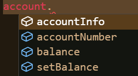

We shall look into what an object is in JS...

* Table of content
{:toc}

## Object

> Refer -> [My notes on OOP, in case you don't know what an object is](2024-06-17-oop.md) and [notes on data types in JS](2024-09-08-js-dtypes.md)

Objects are the representation of real-world objects in the virtual world. In JS, they belong to a type called `object`.

### Creating an object

Objects can be created in 4 ways :

* Using an object initializer [or object literals]
* Using `new`
* Using a factory function
* Using a constructor

#### Object literals

Object is a collection of key-value pairs. These pairs represent an object's properties [in other languages, we call them instance variables].

> If you've dabbled in python before, you must be familiar with dictionaries. What we're going to do now resembles them.

Let's say I'm making a character for Project Zomboid...

```js
const player = {
    name: "Jean Antonique",
    job: "Ranger",
    traitsStengths: ["Outdoorsman", "Axe Man", ""],
    traitsWeakness: ["Thin-skinned", "Fear of Blood", ""],
    //...
    mainWeapon: "Axe"
};
```

Let's try printing the object :

```js
console.log(player);

/*
{
  name: 'Jean Antonique',
  job: 'Ranger',
  ...
  mainWeapon: 'Axe'
}
*/
```

Aww man! We don't need the EXACT thing we declare just moments ago!

To avoid this problem, we simply use the object's keys using an operator called dot operator [.] :

```js
let str = `Name: ${player.name}\nJob: ${player.job}`;

console.log(str);
/*
Name: Jean Antonique
Job: Ranger
*/
```

This operator lets you access the instance variables of an object.

We can also access them using `objectName['propertyName']`. This method's used when a property consists of many words that are separated by space [or if they're enclosed by single quotes].

```js
const player = {
    //...
    'traits strengths': ["Outdoorsman", "Axe Man", ""],
    'traits weakness': ["Thin-skinned", "Fear of Blood", ""],
    //...
};

console.log(player['traits strengths'] + '\n' + player['traits weakness']);

/*
[ 'Outdoorsman', 'Axe Man', '' ]
[ 'Thin-skinned', 'Fear of Blood', '' ]
*/
```

### Factory functions

Object literals are great if we're dealing with a single object. Not so great if we deal with stuff like this that involves duplication :

```js
const player = {
    name: "Jean Antonique",
    job: "Ranger",
    traitStrength: ["Outdoorsman", "Axe Man", ""],
    traitWeakness: ["Thin-skinned", "Fear of Blood", ""],
    jacket: "Wedding Suit",
    shirt: "Dress Shirt",
    pant: "Dress Pants",
    //...
    mainWeapon: "Axe"
};

const playerTwo = {
    name: "Yves Montagne",
    job: "Burger Flipper",
    traitStrength: ["Resilient", "Amateur Mechanic", ""],
    traitWeakness: ["Sunday Driver", "Conspicuous", ""],
    jacket: "Flannel",
    shirt: "Vest",
    pant: "Jeans",
    //...
    mainWeapon: "None"
};
```

> Remember the programmer's adage - **DRY : Don't Repeat Yourself**; don't duplicate unless necessary.

They even share the same properties, to our chagrin. We need some way to ease our workload. What shall we do?

We use factory functions :

```js
function createPLayer (playerName="Anonymous", playerJob="Unemployed", playerStrength, playerWeakness, playerJacket="None", playerShirt="Dress Shirt", playerPant="Jeans", playerWeapon="None")
{
    return {
        name: playerName,
        job: playerJob,
        traitStrength: playerStrength,
        traitWeakness: playerWeakness,
        jacket: playerJacket,
        shirt: playerShirt,
        pant: playerPant,
        //...
        mainWeapon: playerWeapon,
        playerInfo : function()
        {
            console.log(
                //prints arguments provided
            );
        }
    }
}

```

This allows us to create object as per our wish.

```js
const player = createPLayer("Jean Antonique", "Ranger", "Outdoorsman", "Fear of Blood", "Wedding Suit", "Dress Shirt", "Dress Pants", "Axe");

player.playerInfo()
```

#### Pro tip

Now I'll let you know a cool trick - if the key name and the value name [which comes from the function's parameters] are the same, we can get rid of the value name and just keep the key name alone :

```js
function createPLayer (playerName="Anonymous", job="Unemployed", strength, weakness, jacket="None", shirt="Dress Shirt", pant="Jeans", mainWeapon="None")
{
    return {
        playerName, job, strength, weakness, jacket,
        shirt, pant, mainWeapon,
        playerInfo : function()
        {
            console.log(
                //prints arguments provided
            );
        }
    }
}
```

### Constructors

Another way is by using constructors. This word must be familiar to those who know Java or Python - yes, it's a way to create instances of a class. However, JS doesn't have the concept of classes; we'll have to settle with objects alone instead.

```js
function Player(playerName="Anonymous", playerJob="Unemployed", playerStrength, playerWeakness, playerJacket="None", playerShirt="Dress Shirt", playerPant="Jeans", playerWeapon="None")
{
    this.playerName = playerName;
    this.job = job;
    //...
    this.mainWeapon = this.mainWeapon;

    this.playerInfo = function()
    {
        //print the player's information
    }
}

const playerOne = new Player("Jean Antonique", "Ranger", "Outdoorsman", "Fear of Blood", "Wedding Suit", "Dress Shirt", "Dress Pants", "Axe");

```

Wow, it does resemble a Java class, complete with the `this` keyword and `private` instance variables!

Well, to those not in the know, `this` refers to the object involved here. We use it to point to the object instead of point at the program as a whole, allowing us to hide away the complexities of a program.

## Constructor functions for other types

Whenever we use the object literal method to create an object, JS uses a function called `Object()` to construct it.

Same goes for any other type in JS. Don't believe me? Then check this out :

```js
let song = new String("Take Me to Church");
let premier = new Number(1);
let ifElse = new Boolean(true);

console.log(song, premier, ifElse);
/*
[String: 'Take Me to Church']
[Number: 1]
[Boolean: true]
*/
```

This is a cumbersome way of defining a string, number, Boolean, etc. literal. We'd rather use our original way of doing things.

### Adding properties

Since we don't have to deal with classes, we can add properties on the fly to our object.

Now consider the player object we made earlier. We wish to add the starting location of the player. For this, we simply do this :

```js
playerOne.location = "Rosewood";

console.log(playerOne.location);
//Rosewood
```

We can also do this using bracket notation. This is especially useful if you're obtaining the property name at runtime, or if the property name isn't a valid identifier :

```js
const playerWounds = "laceration - head : right";
playerOne[playerWounds] = 1;
console.log(playerOne.wounds);
```

### Deleting properties

Alright, now that we know how to add things, we should also know how to delete things. Here we go :

```js
console.log(playerOne);
/*
Player
{
  playerName: 'Jean Antonique',
  job: 'Ranger',
  playerWeapon: 'Axe'
}
*/

delete playerOne.playerWeapon;
console.log(playerOne);
/*
Player
{
    playerName: 'Jean Antonique',
    job: 'Ranger'
}
*/
```

### Iterating over properties

We're done with our edits. Let's print out the player's info :

```js
function Player(parameters)
{
    return {
        playerName, job, strength, weakness, weapon, jacket, shirt, pant,
        playerInfo : function()
        {
            console.log
            (`
                Name: ${playerName}
                Job: ${job}
                Strength: ${strength}
                Weakness: ${weakness}
                Jacket: ${jacket}
                Shirt: ${shirt}
                Pant: ${pant}
                Weapon: ${weapon}
            `)
        }
        playerOutfit : function()
        {
            console.log(`
            ${playerName} is currently wearing a ${jacket}, underneath which is a ${shirt}, and ${pants}.
            `);
        }
    }
}
console.log(playerOne.playerInfo());
console.log(playerOne.playerOutfit());
```

Now that's a waaay too lengthy code to get everything printed. We could and should use a loop instead to print the properties.

```js
for (let i in playerOne)
{
    console.log(`${i} : ${playerOne[i]}`);
}
/*
playerName : Jean Antonique
job : Ranger
strength : Outdoorsman
weakness : Fear of Blood
weapon : Axe
jacket : Wedding Suit
shirt : Dress Shirt
pant : Dress Pants
playerOutfit : function()
{
    console.log(`${playerName} is currently wearing a ${jacket}, underneath which ia ${shirt}, and ${pants}.`);
}
*/
```

We've solved the problem of printing properties, and are introduced to another : we don't need the method here. How do we remove it?

```js
for (let i in playerOne)
{
    if (typeof playerOne[i]!=='function')
    {
        console.log(`${i} : ${playerOne[i]}`);
    }
}
/*
playerName : Jean Antonique
job : Ranger
strength : Outdoorsman
weakness : Fear of Blood
weapon : Axe
jacket : Wedding Suit
shirt : Dress Shirt
pant : Dress Pants
*/
```

Ta-da! We've got our player's information, finally.

#### Obtaining keys and values

Like I said before, `Object` is another data type. We can access it using the dot operator [or notation] to perform various actions.

`Object.keys()`, for instance, returns the keys of an object :

```js
console.log(Object.keys(playerOne));

/*
['playerName','job','strength','weakness','weapon',
  'jacket','shirt','pant','playerOutfit']
*/
```

And in the same vein, `Object.values` to return the values :

```js
console.log(Object.values(playerOne));
/*
['Jean Antonique','Ranger','Outdoorsman','Fear of Blood','Axe','Wedding Suit','Dress Shirt','Dress Pants',
[Function: playerOutfit]
]
*/
```

What's this ``[Function: playerOutfit]`` you ask? It is the value we obtain when our object has a method inside it. It normally looks like ``[Function: functionName]``.

What if we want both the keys and the values to appear together? We use `Object.entries()` :

```js
console.log(Object.entries(playerOne));
/*
[
  [ 'playerName', 'Jean Antonique' ],
  [ 'job', 'Ranger' ],
  [ 'strength', 'Outdoorsman' ],
  [ 'weakness', 'Fear of Blood' ],
  [ 'weapon', 'Axe' ],
  [ 'jacket', 'Wedding Suit' ],
  [ 'shirt', 'Dress Shirt' ],
  [ 'pant', 'Dress Pants' ],
  [ 'playerOutfit', [Function: playerOutfit] ]     
]
*/
```

## Abstraction

When we say abstraction, we mean hiding away the implementation of our object [or class] and showing only the essentials.

> In a microwave, you have on the inside the circuit board, heating mechanism, etc. and buttons on the outside. We can only access its functions using the allowed actions [the buttons].

Say, we want to create a program to resemble a bank. We'd ask our user for their account number and then create an object based on it.

```js
function banque(accountNumber)
{
    this.accountInfo = function()
    {
        return (accountNumber);
    }
    //withdraw()
    //deposit()
}

const input = prompt("Enter your account number: ");
const account = new banque(input);
```

Now let's start adding functionality to our object. Let's introduce a balance property :

```js
function banque(accountNumber)
{
    this.accountNumber = accountNumber;
    this.balance = 0;

    this.setBalance = function(amount)
    {
        if (amount>0)
        {
            this.balance = amount;
        }
    }
    this.accountInfo = function()
    {
        return (`
            Account: ${this.accountNumber}
            Balance: ${this.balance}
            `);
    }
    //withdraw()
    //deposit()
}
```

When we use the dot operator with our `account` object, the following appear :



This is not good. We shouldn't allow our dearest, most private properties to be handled by the user.

We have to demote them to local, alas :

```js
function banque(accountNumber)
{
    let balance = 0;

    this.setBalance = function(amount)
    {
        if (amount>0)
        {
            balance = amount;
        }
    }
    this.getBalance() = function()
    {
        return balance;
    }
    this.accountInfo = function()
    {
        return (`
            Account: ${accountNumber}
            Balance: ${getBalance()}
            `);
    }
    //withdraw()
    //deposit()
}
```

Here I've gotten rid of the `accountNumber` variable and added a getter function [function that gets something]. This allows us to simply use `getBalance()` in situations where you'll need the balance.

Helps us keep our code encapsulated [neatly arranged with getters and setters].

### Getting and setting properties

Another way we can get properties is by our old friend, `Object` type.
