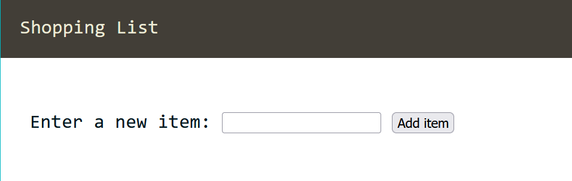
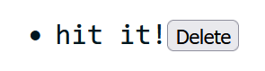

Shall we animate the web?

* Table of content
{:toc}

## Events

**Events** are actions that happen in your webpage [mouse clicks, hovering, etc.]

We can make our HTML page do stuff by letting it *listen to* and react to events. In short, we're making our page be interactive and animated.

To listen to these events happening, we use event listeners.

### Event listeners

Back to our previous code. I've converted it back to a normal HTML code and added a button in there.

```html
<button id="button">Surprise Me!</button>
```

To add an event listener, we'd go to our JS file and...

```js
let button = document.querySelector("#button");

button.onclick = () => alert("Hey");
```

Another way to do this is to have a general function that'll accept all sorts of events :

```js
let button = document.querySelector("#button");

button.addEventListener("click", () =>
{
    alert("Hey");
}
);
```

The anonymous function [or just any function] we're passing as argument is called a **callback**.

### Example

I have created a web page consisting of an input field. When I start typing on the field, I want my page to display which key is pressed.

```js
function keyIndicator()
{
    output.textContent = `You pressed "${event.key}"`;
}
let text = document.getElementById("text");
let output = document.querySelector("#output");

text.addEventListener("keydown", keyIndicator);
```

### Event bubbling

It's this concept where an element receives an event and the event is transmitted to its parent, parent's parent, etc. until it gets to the root element `<html>`.

Let me demonstrate with an example :

```html
<!--...-->
<div class="container">
    <input id="text" name="text" type="text">
    <div id="output"></div>
</div>
<!--...-->
```

```js
function keyIndicator()
{
    output.textContent = `You pressed "${event.key}"`;
}
let text = document.getElementById("text");
let output = document.querySelector("#output");

text.addEventListener("keydown", keyIndicator)
```

When I press a key in my keyboard, I trigger an event via `text`. The transmission probably happens this way :

`<input>` -> `<div>` -> `<div>` -> `<body>` -> `<html>`

There. We've reached the root.

Event bubbling let's you handle an event in a parent element instead of its child who received the event [inheritance to the win]. This practice is called **Event Delegation**.

#### Stopping it

Event bubbling is an event's default behaviour. Now let's say we've a parent element with its children having different events :

```js
let divContainer = document.querySelector(".container");
let divContent = document.querySelector("#content");
let span = document.querySelector("#span");
let button = document.querySelector("#button");

divContainer.onclick = console.log("container");
divContent.onclick = console.log("content");
span.onclick = console.log("span");
button.onclick = console.log("button");
/*
container
content
span
button
*/
```

What if I don't want these extra events to be triggered when I press the button?

We use `event.stopPropagation()` :

```js
function printToConsole()
{
    event.stopPropagation();
    console.log("button")
}
//...
button.onclick = printToConsole;
//button
```

### Preventing default behaviour

Sometimes, when we deal with forms and such we fill in 

### Problems - Events

#### Shopping List

Make a shopping list that lets you add items to list using a form input and button. It should also do the following :

- The item should appear in the list.
- Each item should be given a button that can be pressed to delete that item off the list.
- The input should be emptied and focused ready for you to enter another item.

##### HTML and CSS

```html
<!DOCTYPE html>
<html lang="en">
<head>
    <meta charset="UTF-8">
    <meta name="viewport" content="width=device-width, initial-scale=1.0">
    <title>Document</title>
    <link rel="stylesheet" href="one.css">
</head>
<body>
    <div class="container">
        <section id="header">
            <header id="heading">Shopping List</header>
        </section>
        <section id="content">
            <div id="left">
                <label id="label" for="item">Enter a new item: </label>
                <input type="text" name="item" id="item-text">
                <button id="button">Add item</button>
            </div>
            <div id="right">
                <ul id="list">
                </ul>
            </div>
        </section>
    </div>
    <script type="text/javascript" src="one.js"></script>
</body>
</html>
```

```css
:root
{
    --bg : #EDEBD7;
    --head: #423E37;
    --text: #00171F;
    --button: #A39594;
}

body
{
    margin: 0;
    padding: 0;
    font-size: 20px;
}

#header
{
    background-color: var(--head);
    padding: 1em;
}

#heading
{
    font-family: monospace;
    color: var(--bg);
}

#content
{
    padding: 0.5em;
    margin: 1.7em 0.5em 2em 0.5em;
    color: var(--text);
    font-family: monospace;
}

#left, #right
{
    padding: 0.5em;
}
```



##### JS

Now that we're settled, let's begin with the JS part.

We reference the button, the list and input elements using `getElementById()` :

```js
let button = document.getElementById("button");
let list = document.getElementById("list");
let textBox = document.getElementById("item-text");
```

Then we added an event listener that calls the `addItem()` function [which we're gonna create now] when the button is clicked :

```js
button.onclick = addItem;
```

In the function, we store the value we get from input box and then set the input box's value as blank [i.e. we're clearing our input for next item] :

```js
function addItem()
{
    let inputReceived = textBox.value;
    textBox.value = "";
    //...
}
```

Then we create 3 new elements - a list item, a `<span>` text and a button - and attach the text and button to our list item.

```js
function addItem()
{
    //...
    let listItem = document.createElement("li");
    let span = document.createElement("span");
    let itemButton = document.createElement("button");

    listItem.appendChild(span);
    listItem.appendChild(itemButton);
    //...
}
```

We do this as we want it to look like this :



After that, we assign input's value to the `<span>` text and add the word 'Delete' to the button. This is done before attaching [or appending] the list item to the list :

```js
function addItem()
{
    //...
    span.textContent = inputReceived;
    itemButton.textContent = "Delete";

    list.appendChild(listItem);
    //...
}
```

We're almost done. Now to delete our list item, we open up another event listener that removes it when we click the 'Delete' button :

```js
function addItem()
{
    //...
    itemButton.addEventListener("click", function(){
    listItem.remove();
    });
    //...
}
```

This is optional, but we can add `focus()` to focus on input field to enter items one after other :

```js
function addItem()
{
    //...
    textBox.focus();
    //...
}
```

Now, to summarise what I've been doing so far :

- Create a HTML file and add CSS style to it. Also have a JS file linked to the HTML file.
- Reference the button, list, input elements.
- Add event listener to button that calls `addItem()` upon click.
- In `addItem()`, store value from input and clear the input field.
- Create 3 elements - list item, `<span>` text, button
- Append `<span>` and button to list item.
- Assign input value to text; set button value to 'Delete'.
- Append list item to list.
- Add event listener to button that deletes list item when clicked.
